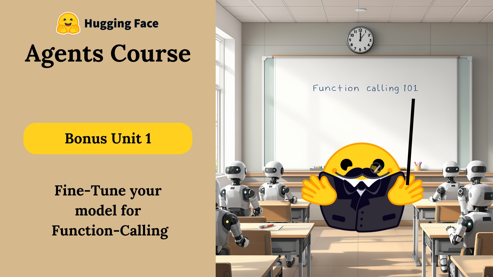

# 🎁 Bonus Unit 1: Fine-Tuning an LLM for Function-Calling



---

## 🧠 Introduction

Function-calling is an essential technique in modern LLM applications. Unlike prompt-only models, a function-calling model is trained to **decide when to act**, **call external tools**, and **interpret their results**.  
This unit goes beyond what you learned in Unit 1 and shows how to build such models.

---

## ⏳ When Should I Take This?

<details>
<summary>📌 Click to find out</summary>

This unit is optional but highly valuable. We recommend taking it if:

- You've completed Unit 1 and understand prompt-based systems.
- You want your LLM to actively interact with tools via APIs.
- You're comfortable with basic fine-tuning using Hugging Face.

Don’t worry if you’re new to some concepts — we link all required resources.

📖 Prerequisites:
- ✅ [Fine-Tune an LLM](https://huggingface.co/course/chapter3/3?fw=pt)
- ✅ [SFTTrainer Docs](https://huggingface.co/docs/trl/main/en/sft_trainer)
</details>

---

## 📚 Unit Progress

```markdown
### Core Concepts
- [x] [Introduction](./README.md)
- [x] [What is Function Calling?](./Function-Calling.md)
- [x] [Fine-Tune for Function-Calling](./Fine-Tune-for-Function-Calling.md)
- [x] [Hands-on Implementation](./bonus_unit1.ipynb)
```

---

## 🚀 What You’ll Learn

### 🧩 Function Calling  
Modern LLMs can structure conversations to trigger **external Tools/APIs** like weather checkers or search engines.  
📄 [Learn more →](./Function-Calling.md)

---

### ⚙️ LoRA (Low-Rank Adaptation)  
A technique to fine-tune large models **efficiently** by updating only a small number of parameters.  
🔗 [LoRA Concept Guide](https://huggingface.co/docs/peft/conceptual_guides/lora)

---

### 🧠 Thought → Act → Observe Cycle  
A structured reasoning flow:
1. **Thought** – Internal reasoning  
2. **Act** – Calls external function/tool  
3. **Observe** – Handles the result/output

<details>
<summary>🧪 Example Format</summary>

```yaml
user: "Get me today's weather in Paris."
model:
  function_call:
    name: getWeather
    arguments:
      city: "Paris"
```

</details>

---

### 🏷️ Special Tokens  
Used to separate:
- 💭 Internal thoughts (`<thought>`)
- 🔧 Function calls (`<function>`)
- 📩 Observations/results (`<observation>`)

This helps the model distinguish reasoning from external actions.

---

## 🎯 Learning Outcomes

By completing this unit, you will:

✅ Understand how APIs interact with LLMs  
✅ Fine-tune an instruction-following model using LoRA  
✅ Apply the Thought → Act → Observe cycle in training  
✅ Use special tokens to enhance structured reasoning  
✅ Build a fully fine-tuned model for function-calling 🔥

---

## 📂 Implementation Files

| File | Description |
|------|-------------|
| [bonus_unit1.ipynb](./bonus_unit1.ipynb) | Hands-on notebook |
| [Function-Calling.md](./Function-Calling.md) | Concept overview |
| [Fine-Tune-for-Function-Calling.md](./Fine-Tune-for-Function-Calling.md) | Training guide |

---

## 🔍 Additional Resources

- 🧠 [Hugging Face Transformers Course](https://huggingface.co/course)
- 📘 [LoRA Documentation](https://huggingface.co/docs/peft/conceptual_guides/lora)
- 🧪 [SFTTrainer Documentation](https://huggingface.co/docs/trl/main/en/sft_trainer)

---

## 🛠️ Prerequisites

To run the code:

- Python 3.8+
- PyTorch
- `transformers`
- `peft`
- `trl`

You can install with:

```bash
pip install torch transformers peft trl
```

---

## 📝 Notes

- All code is in the Jupyter Notebook
- Documentation is split into linked Markdown files
- LoRA is used for efficient fine-tuning

---

### ✅ Final Checklist

```markdown
- [x] Understand Function Calling
- [x] Learn about LoRA
- [x] Apply Thought → Act → Observe
- [x] Fine-tune using Hugging Face tools
- [x] Complete the hands-on notebook
```
```