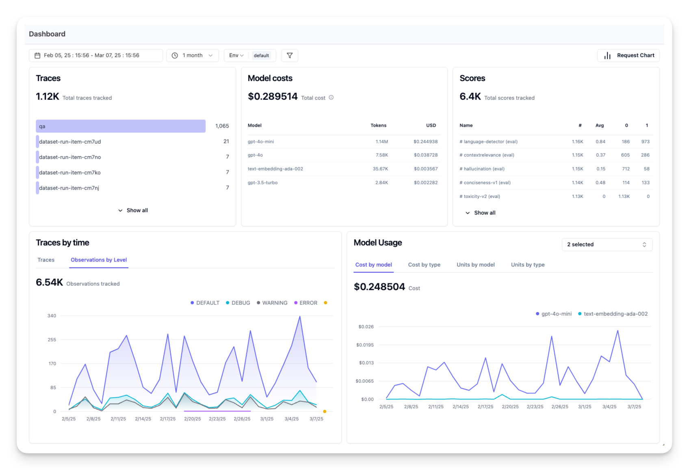

# 🧠 AI Agent Observability & Evaluation

Welcome to **Bonus Unit 2**! This chapter focuses on advanced strategies to monitor, evaluate, and improve AI agent performance.

---

## 🔍 What is Observability?

**Observability** helps you understand your agent's internal behavior using external signals like:

* Logs
* Metrics (costs, latency)
* Traces & spans (e.g., model/tool calls)

> 🔁 **Tracking Action** = Entire agent runs
> 🔹 **Tool Usage** = Individual steps in that run
> **Model Calls** = 
> **Responses** = To debug & improve Agent Performance

---

## 🌟 Why Agent Observability Matters

Without observability, agents are *black boxes*. With the right tools, you can:

- Understand costs and accuracy trade-offs
- Measure latency
- Detect harmful language & prompt injection
- Monitor user feedback

---

## 🔨 Observability Tools

* Tools: **Langfuse**, **Arize**, etc.
* Instrumentation: **OpenTelemetry**, **custom SDKs**
* Frameworks like **smolagents** support built-in observability

---

## 🔬Traces and Spans
Observability tools usually represent agent runs as traces and spans.

- **Traces** represent a complete agent task from start to finish (like handling a user query).
- **Spans** are individual steps within the trace (like calling a language model or retrieving data).

## 📈 Key Metrics to Monitor

| Metric              | Why It Matters                                                                  |
| ------------------- | ------------------------------------------------------------------------------- |
| ⏱️ Latency          | Impacts UX; optimize long-running model/tool calls                              |
| 💰 Cost             | Token/API usage can spike quickly – monitor for inefficiencies or bugs          |
| ❌ Errors            | Track API/tool failures and implement retries/fallbacks                         |
| 👍 User Feedback    | Explicit ratings (stars, thumbs) or textual responses indicate performance      |
| 🔁 Implicit Signals | Repeats, retries, or rephrases often signal dissatisfaction                     |
| ✅ Accuracy          | Depends on task — define and track success (e.g., task completed, correct info) |
| 🤖 Auto-Evals       | Use LLMs or tools like [**RAGAS**](https://docs.ragas.io/), [**LLM Guard**](https://llm-guard.com/) for scoring outputs             |

---

## 🧪 Evaluation AI Agents 

Observability gives us metrics, but evaluation is the process of analyzing that data (and performing tests) to determine how well an AI agent is performing and how it can be improved.

- Regular evaluation is important because AI agents are often non-deterministic and can evolve (through updates or drifting model behavior)

- There are two categories of evaluations for AI agents: online evaluation and offline evaluation

### 🥷 Offline Evaluation

* Run tests with known outputs (e.g., GSM8K dataset)
* Good for repeatable benchmarks and CI/CD checks
* Be mindful of dataset drift — regularly update test sets

### 🔄 Online Evaluation

* Monitors real users and queries
* Tracks real-time success, satisfaction, model drift
* Use A/B tests, feedback forms, retry patterns

### 🧩 Combine Both!

* Offline = controlled benchmarking
* Online = real-world validation
* Loop: offline test → deploy → monitor online → collect failures → improve tests

>In fact, many teams adopt a loop: *offline evaluation → deploy new agent version → monitor online metrics and collect new failure examples → add those examples to offline test set → iterate*. This way, evaluation is continuous and ever-improving.

---

## 📦 TL;DR

Observability = visibility into your agent
Evaluation = interpreting those signals to improve quality
👉 Together, they ensure your agent is *production-ready, reliable, and continuously improving.*
