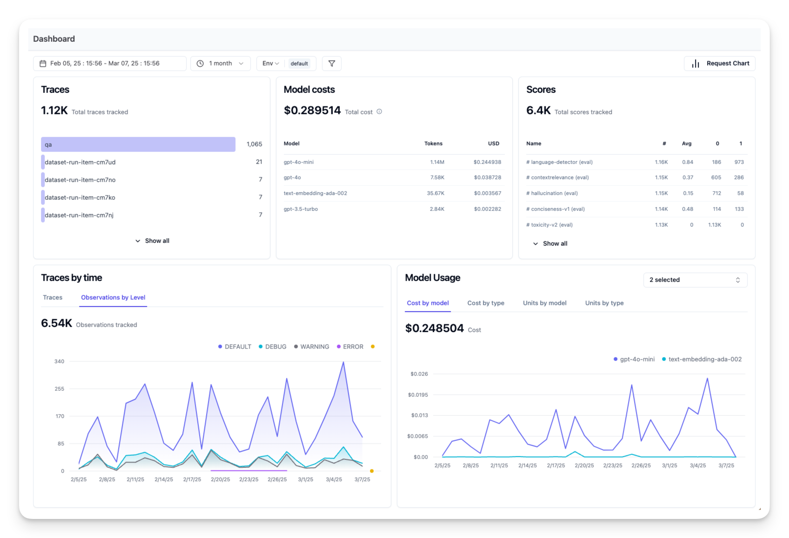

# 🧠 Bonus Unit 2: Observability and Evaluation of Agents

<a href="./monitoring_and_evaluating_agents_notebook.ipynb" target="_blank">
  
</a>

In this notebook, we learn how to **monitor internal steps (traces)** of an AI agent and **evaluate performance** using open-source observability tools like **Langfuse** and **OpenTelemetry**.

---

### ✅ Why Observability Matters

Observability helps:

* Debug task failures or suboptimal results
* Monitor real-time cost and performance
* Improve reliability and safety through feedback

---

### 🏗️ Prerequisites

* 📘 Studied: [**Introduction to Agents**](../Unit-1-Intro-to-Agents/README.md)
* 📘 Studied: [**smolagents Framework**](../Unit-2-Framework-for-AI-Agents/Unit-2.1-Smolagents/README.md)

---

### ⚙️ Step 0: Install Required Libraries

```bash
%pip install 'smolagents[telemetry]'
%pip install opentelemetry-sdk opentelemetry-exporter-otlp openinference-instrumentation-smolagents
%pip install langfuse datasets 'smolagents[gradio]'
```

---

### 🔌 Step 1: Instrument the Agent

* Configure `LANGFUSE` environment variables
* Set up Hugging Face token (`HF_TOKEN`)
* Use `SmolagentsInstrumentor()` to enable tracing
* Configure OpenTelemetry TracerProvider with `OTLPSpanExporter`

```python
import os
import base64

# Get your own keys from https://cloud.langfuse.com
LANGFUSE_PUBLIC_KEY = "pk-lf-..." 
LANGFUSE_SECRET_KEY = "sk-lf-..." 
os.environ["LANGFUSE_PUBLIC_KEY"] = LANGFUSE_PUBLIC_KEY
os.environ["LANGFUSE_SECRET_KEY"] = LANGFUSE_SECRET_KEY
os.environ["LANGFUSE_HOST"] = "https://cloud.langfuse.com"  # 🇪🇺 EU region example
# os.environ["LANGFUSE_HOST"] = "https://us.cloud.langfuse.com"  # 🇺🇸 US region example

LANGFUSE_AUTH = base64.b64encode(
    f"{LANGFUSE_PUBLIC_KEY}:{LANGFUSE_SECRET_KEY}".encode()
).decode()

os.environ["OTEL_EXPORTER_OTLP_ENDPOINT"] = os.environ.get("LANGFUSE_HOST") + "/api/public/otel"
os.environ["OTEL_EXPORTER_OTLP_HEADERS"] = f"Authorization=Basic {LANGFUSE_AUTH}"
```
**Hugging Face token for Inference Calls**
```python
# Set your Hugging Face and other tokens/secrets as environment variable
os.environ["HF_TOKEN"] = "hf_..." 
```
**Set up the a tracer-provider for our configured OpenTelemetry.**

```python
from opentelemetry.sdk.trace import TracerProvider
from openinference.instrumentation.smolagents import SmolagentsInstrumentor
from opentelemetry.exporter.otlp.proto.http.trace_exporter import OTLPSpanExporter
from opentelemetry.sdk.trace.export import SimpleSpanProcessor
 
# Create a TracerProvider for OpenTelemetry
trace_provider = TracerProvider()

# Add a SimpleSpanProcessor with the OTLPSpanExporter to send traces
trace_provider.add_span_processor(SimpleSpanProcessor(OTLPSpanExporter()))

# Set the global default tracer provider
from opentelemetry import trace
trace.set_tracer_provider(trace_provider)
tracer = trace.get_tracer(__name__)

# Instrument smolagents with the configured provider
SmolagentsInstrumentor().instrument(tracer_provider=trace_provider)
```

---

### 🧪 Step 2: Test Instrumentation

Use a simple `CodeAgent` to test instrumentation:
- If everything is set up correctly, you will see logs/spans in your observability dashboard.

```python
from smolagents import HfApiModel, CodeAgent

# Create a simple agent to test instrumentation
agent = CodeAgent(
    tools=[],
    model=HfApiModel()
)

agent.run("1+1=")
```

👉 Check [Langfuse Traces Dashboard](https://cloud.langfuse.com/) to confirm that the spans & logs have been recorded

---

### 🔍 Step 3: Monitor a Complex Agent

Use a more advanced query:

```python
from smolagents import (CodeAgent, DuckDuckGoSearchTool, HfApiModel)

search_tool = DuckDuckGoSearchTool()
agent = CodeAgent(tools=[search_tool], model=HfApiModel())

agent.run("How many Rubik's Cubes could you fit inside the Notre Dame Cathedral?")
```

* Traces include tool/LLM calls, token usage, latency, and cost

**Trace Structure**
Most observability tools record a trace that contains spans, which represent each step of your agent’s logic. Here, the trace contains the overall agent run and sub-spans for:
- The tool calls (DuckDuckGoSearchTool)
- The LLM calls (HfApiModel)

---


### 📊 Production Evaluation: Metrics to Track

1. **Costs**: Monitor token usage → estimate \$ cost
2. **Latency**: Track response time per step
3. **Custom Attributes**: Add metadata like user/session IDs
4. **User Feedback**: Capture thumbs up/down in UI
5. **LLM-as-a-Judge**: Auto-evaluate output quality/toxicity

---
#### 1. 💲 Cost
Below is a screenshot showing usage for Qwen2.5-Coder-32B-Instruct calls. This is useful to see costly steps and optimize your agent.
[Link to the trace](https://cloud.langfuse.com/project/cloramnkj0002jz088vzn1ja4/traces/1ac33b89ffd5e75d4265b62900c348ed?timestamp=2025-03-07T13%3A45%3A09.149Z&display=preview)


#### 2. ⚡ Latency 
We can also see how long it took to complete each step.


#### 3. 🧩 Add Custom Trace Attributes
You may also pass additional attributes—such as user IDs, session IDs, or tags—by setting them on the spans.

```python
from smolagents import (CodeAgent, DuckDuckGoSearchTool, HfApiModel)
from opentelemetry import trace

search_tool = DuckDuckGoSearchTool()
agent = CodeAgent(
    tools=[search_tool],
    model=HfApiModel()
)

with tracer.start_as_current_span("Smolagent-Trace") as span:
    span.set_attribute("langfuse.user.id", "smolagent-user-123")
    span.set_attribute("langfuse.session.id", "smolagent-session-123456789")
    span.set_attribute("langfuse.tags", ["city-question", "testing-agents"])

    agent.run("What is the capital of Germany?")
```

---

#### 4. 💬 User Feedback via Gradio
If your agent is embedded into a user interface, you can record direct user feedback (like a thumbs-up/down in a chat UI). 

* Capture real-time feedback from users
* Store feedback as scores in Langfuse

```python
import gradio as gr
from opentelemetry.trace import format_trace_id
from smolagents import (CodeAgent, HfApiModel)
from langfuse import Langfuse

langfuse = Langfuse()
model = HfApiModel()
agent = CodeAgent(tools=[], model=model, add_base_tools=True)

formatted_trace_id = None  # We'll store the current trace_id globally for demonstration

def respond(prompt, history):
    with trace.get_tracer(__name__).start_as_current_span("Smolagent-Trace") as span:
        output = agent.run(prompt)

        current_span = trace.get_current_span()
        span_context = current_span.get_span_context()
        trace_id = span_context.trace_id
        global formatted_trace_id
        formatted_trace_id = str(format_trace_id(trace_id))
        langfuse.trace(id=formatted_trace_id, input=prompt, output=output)

    history.append({"role": "assistant", "content": str(output)})
    return history

def handle_like(data: gr.LikeData):
    # For demonstration, we map user feedback to a 1 (like) or 0 (dislike)
    if data.liked:
        langfuse.score(
            value=1,
            name="user-feedback",
            trace_id=formatted_trace_id
        )
    else:
        langfuse.score(
            value=0,
            name="user-feedback",
            trace_id=formatted_trace_id
        )

with gr.Blocks() as demo:
    chatbot = gr.Chatbot(label="Chat", type="messages")
    prompt_box = gr.Textbox(placeholder="Type your message...", label="Your message")

    # When the user presses 'Enter' on the prompt, we run 'respond'
    prompt_box.submit(
        fn=respond,
        inputs=[prompt_box, chatbot],
        outputs=chatbot
    )

    # When the user clicks a 'like' button on a message, we run 'handle_like'
    chatbot.like(handle_like, None, None)

demo.launch()

```


---

#### 5. ⚖️ LLM-as-a-Judge
LLM-as-a-Judge is another way to automatically evaluate your agent’s output.
- You can set up a separate LLM call to gauge the output’s correctness, toxicity, style, or any other criteria you care about.

**Workflow**:

1. You define an Evaluation Template, e.g., “Check if the text is toxic.”
2. Each time your agent generates output, you pass that output to your “judge” LLM with the template.
3. The judge LLM responds with a rating or label that you log to your observability tool.

```python
# Example: Checking if the agent’s output is toxic or not.
from smolagents import (CodeAgent, DuckDuckGoSearchTool, HfApiModel)

search_tool = DuckDuckGoSearchTool()
agent = CodeAgent(tools=[search_tool], model=HfApiModel())

agent.run("Can eating carrots improve your vision?")
```

---

#### 6. 📉 Observability Metrics Overview
 All of these metrics can be visualized together in dashboards. This enables you to quickly see how your agent performs across many sessions and helps you to track quality metrics over time.



---
### 📊 Offline Evaluation with Langfuse + Smolagent

Offline evaluation provides systematic quality checks during development—before live deployment—ensuring your AI agent performs reliably on known benchmarks.

---

### ✅ Step-by-Step Evaluation Flow

#### 1. **Load a Benchmark Dataset**
In offline evaluation, you typically:

1. Have a benchmark dataset (with prompt and expected output pairs)
2. Run your agent on that dataset
3. Compare outputs to the expected results or use an additional scoring mechanism


```python
from datasets import load_dataset
import pandas as pd

dataset = load_dataset("openai/gsm8k", 'main', split='train')
df = pd.DataFrame(dataset)
```

* **Dataset**: [GSM8K](https://huggingface.co/datasets/openai/gsm8k) – math questions and solutions
* Use the first 10 items for demo purposes

---

#### 2. **Create Dataset in Langfuse**

```python
from langfuse import Langfuse

langfuse = Langfuse()
langfuse_dataset_name = "gsm8k_dataset_huggingface"

langfuse.create_dataset(
    name=langfuse_dataset_name,
    description="GSM8K benchmark dataset uploaded from Huggingface",
    metadata={ "date": "2025-03-10", "type": "benchmark" }
)
```

Then upload the examples:

```python
for idx, row in df.iterrows():
    langfuse.create_dataset_item(
        dataset_name=langfuse_dataset_name,
        input={"text": row["question"]},
        expected_output={"text": row["answer"]},
        metadata={"source_index": idx}
    )
    if idx >= 9: break  # limit to 10 items
```

---

#### 3. **Run Agent on Dataset Items**

Use Smolagent with OpenTelemetry instrumentation

We define a helper function run_smolagent() that:
1. Starts an OpenTelemetry span
2. Runs our agent on the prompt
3. Records the trace ID in Langfuse
Then, we loop over each dataset item, run the agent, and link the trace to the dataset item. We can also attach a quick evaluation score if desired.

```python
from smolagents import CodeAgent, HfApiModel
from opentelemetry.trace import format_trace_id

model = HfApiModel()
agent = CodeAgent(tools=[], model=model, add_base_tools=True)

def run_smolagent(question):
    with tracer.start_as_current_span("Smolagent-Trace") as span:
        output = agent.run(question)
        trace_id = format_trace_id(trace.get_current_span().get_span_context().trace_id)
        langfuse_trace = langfuse.trace(id=trace_id, input=question, output=output)
    return langfuse_trace, output
```

Then evaluate:

```python
dataset = langfuse.get_dataset(langfuse_dataset_name)

for item in dataset.items:
    langfuse_trace, output = run_smolagent(item.input["text"])
    item.link(langfuse_trace, run_name="smolagent-notebook-run-01", run_metadata={ "model": model.model_id })
    langfuse_trace.score(name="<example_eval>", value=1, comment="This is a comment")
```

Flush telemetry:

```python
langfuse.flush()
```

---

### 🔍 Analysis & Comparison

You can compare:

* 📌 Model types (e.g. OpenAI, Anthropic, open-source)
* 🛠️ Tool configurations (e.g. search vs no-search)
* 📢 Prompt variants (system messages, instructions)

Langfuse provides **run comparisons, trace linking**, and **evaluation dashboards**.

---

## 🧠 Final Takeaways

This notebook shows how to:

1. **Set up Observability** using smolagents + OpenTelemetry exporters
2. **Check Instrumentation** by running a simple agent
3. **Capture Detailed Metrics** (cost, latency, etc.) through an observability tools
4. **Collect User Feedback** via a Gradio interface
5. **Use LLM-as-a-Judge** to automatically evaluate outputs
6. **Perform Offline Evaluation** with a benchmark dataset

---

### 📎 Useful Links

* 🔗 [Langfuse Traces](https://cloud.langfuse.com)
* 🔗 [smolagents GitHub](https://github.com/smol-ai/smolagents)

