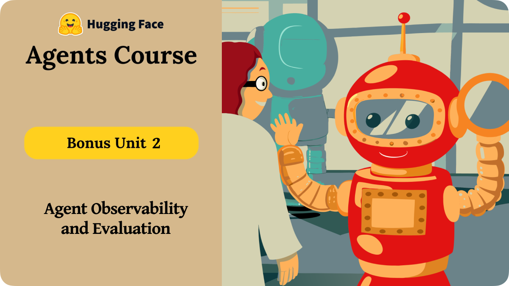

# 🧠 Bonus Unit 2: AI Agent Observability & Evaluation
[Start Here](AI-Agent-Observability-&-Evaluation.md)



This unit focuses on **observability and evaluation** - tools and methodologies designed to help you monitor, debug, and improve your AI agents in production.

## 📋 Unit Structure

### 1. AI Agent Observability & Evaluation
- [x] [AI Agent Observability & Evaluation](./AI-Agent-Observability-&-Evaluation.md)

### 2. Observability and Evaluation Practise
- [x] [Observability and Evaluation of Agents](./Obervability-&-Evaluation-of-Agents.md)
- [x] [Observability and Evaluation of Agents Handon Practise](./monitoring_and_evaluating_agents_notebook.ipynb)

## 📚 Course Progress

### ✅ Completed Units
- [x] [Unit 0: Welcome to the Course](../Unit-0-Welcome/README.md)
- [x] [Unit 1: Introduction to Agents](../Unit-1-Intro-to-Agents/README.md)
- [x] [Unit 2: Frameworks for AI Agents](../Unit-2-Framework-for-AI-Agents/README.md)
- [x] [Bonus Unit 2: AI Agent Observability & Evaluation](AI-Agent-Observability-&-Evaluation.md)

## 📌 When to Use Observability & Evaluation

<details>
<summary>📋 Click to expand</summary>

Use observability and evaluation when:

- You **deploy AI agents** in production environments
- You need to **debug task failures** or suboptimal results
- You want to **monitor costs** and performance in real-time
- You aim to **improve reliability** through feedback loops
- You need to **track usage patterns** and optimize resources

Skip it when:
- You're in early development/prototyping
- You have simple, non-critical applications
- You don't need detailed performance insights
</details>

## 🔧 Key Components of Observability

<details>
<summary>🔍 Click to expand</summary>

To build robust observability for your agents, you need:

- **Tracing System** – OpenTelemetry for comprehensive monitoring
- **Metrics Collection** – Cost, latency, and quality metrics
- **Feedback Mechanisms** – User feedback and LLM-as-a-Judge
- **Visualization Tools** – Langfuse dashboard for insights
- **Alerting System** – For anomalies and critical issues
- **Evaluation Framework** – For benchmarking and improvement
</details>

## 🎯 What You'll Learn

### 1. 🛠️ Instrument Your Agent
- Set up **OpenTelemetry** for comprehensive tracing
- Integrate with **Langfuse** for production monitoring
- Configure **smolagents** with telemetry capabilities
- Add custom trace attributes for context

### 2. 📈 Monitor Key Metrics
- **Cost Analysis**
  * Token usage tracking
  * Cost per operation
  * Usage patterns and optimization

- **Performance Metrics**
  * Latency per step
  * Response times
  * Tool execution times

- **Quality Metrics**
  * Error rates and tracebacks
  * Success rates
  * Custom performance indicators

### 3. 🧪 Real-Time Evaluation
- **User Feedback Integration**
  * Gradio UI for feedback collection
  * User satisfaction tracking
  * Feedback trend analysis

- **LLM-as-a-Judge**
  * Automated quality assessment
  * Toxicity detection
  * Style and correctness evaluation

### 4. 🗃️ Offline Analysis
- **Benchmark Performance**
  * Standard dataset evaluation
  * Agent behavior comparison
  * Improvement tracking

- **Production Monitoring**
  * Anomaly detection
  * Usage pattern analysis
  * System health monitoring

## 🚀 Getting Started

1. Install required dependencies:
```bash
pip install 'smolagents[telemetry]'
pip install opentelemetry-sdk opentelemetry-exporter-otlp openinference-instrumentation-smolagents
pip install langfuse datasets 'smolagents[gradio]'
```

2. Set up your environment variables for Langfuse and other services
3. Follow the detailed notebook for step-by-step implementation

## 📚 Additional Resources

- [Observability & Evaluation Notebook](./monitoring_and_evaluating_agents_notebook.ipynb)
- [Detailed Guide](./Obervability-&-Evaluation-of-Agents.md)
- [AI Agent Observability Guide](./AI-Agent-Observability-&-Evaluation.md)
- [Langfuse Documentation](https://langfuse.com/docs)
- [OpenTelemetry Documentation](https://opentelemetry.io/docs/)
