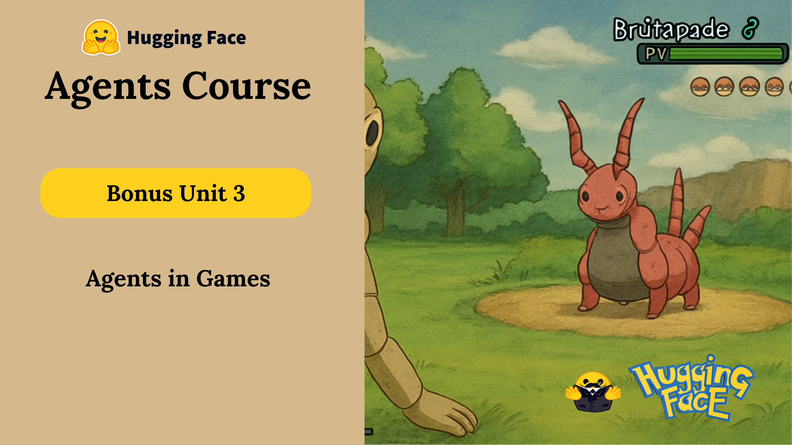

# 🎮 Bonus Unit 3: AI in Games

> *"I want to be the very best…" 🎶*

Welcome to the **bonus unit** where cutting-edge **AI agents meet the world of games**! 🤖🕹️
Get ready to explore how **LLMs (Large Language Models)** are revolutionizing gameplay, storytelling, and character interaction.

---

## 🌟 What You'll Learn

In this unit, you'll:

* 🧠 **Build an AI Agent** that can engage in **Pokémon-style turn-based battles**
* 🕹️ **Play against your agent** or even challenge others online
* 💡 Discover how **agentic behavior** transforms NPCs from static to dynamic, intelligent companions (or foes!)

---

## 🤖 LLMs x Games: The Future of Play

Imagine NPCs that:

* Have unscripted conversations
* Adapt to your strategies in real-time
* Learn and evolve throughout the game

This is the power of combining **LLMs + agentic systems** — creating **emergent storytelling** and immersive gameplay.

> 🧩 Inspired by community projects like *Claude plays Pokémon*, you'll now learn how to **replicate this magic** with your own agents using the skills you've built throughout the course.

---

## 🚀 Want to Go Further?

* 🎓 **Master LLMs in Games**
  Continue your learning with the [Machine Learning for Games Course](https://hf.co/learn/ml-games-course).

* 📘 **Get the AI Playbook**
  Unlock insights and strategies from the [AI Playbook for Game Developers](https://thomassimonini.substack.com/).

---

Before jumping in, let's look at **4 real-world examples** of how LLMs are **already reshaping the gaming industry**. Let’s build the future of play — together.

---

Here’s a polished and engaging Markdown summary of your content:

---

# 🎮 The State of the Art in Using LLMs in Games

To appreciate how far the industry has come, let’s explore **three groundbreaking tech demos** and **one published game** that demonstrate the power of **LLMs in gaming**.

---

## 🕵️‍♂️ *Covert Protocol* by NVIDIA & Inworld AI

**Covert Protocol** is a GDC 2024 tech demo that casts you as a private detective in a narrative-driven mystery.

* 🎭 Features **real-time conversational NPCs** that adapt to your questions
* 🧠 Built using **Unreal Engine 5**, **NVIDIA’s ACE**, and **Inworld AI**
* 📚 Your dialogue shapes the story dynamically, creating a personalized experience

🔗 [Learn more on Inworld AI Blog](https://inworld.ai/blog/nvidia-inworld-ai-demo-on-device-capabilities)

---

## 🤖 *NEO NPCs* by Ubisoft

Also unveiled at GDC 2024, **Ubisoft’s NEO NPCs** push the boundaries of immersive AI characters.

* 👀 NPCs can **perceive their surroundings**
* 🧠 **Remember past interactions**
* 💬 Engage in rich, generative conversations with players

The goal? **Create living worlds** where player interaction feels truly meaningful.

🔗 [Learn more on Inworld AI Blog](https://inworld.ai/blog/gdc-2024)

---

## ⚔️ *Mecha BREAK* featuring NVIDIA ACE

**Mecha BREAK** is a fast-paced multiplayer mech battle game with a futuristic twist—**AI-powered NPCs**.

* 🗣️ NPCs support **natural language interaction**
* 👁️ Can **recognize players and in-game objects** via webcam
* 🧠 Powered by **GPT-4o** and NVIDIA’s **ACE technology**

Expect more **immersive**, **personalized** gameplay experiences than ever before.

🔗 [Read more on NVIDIA Blog](https://blogs.nvidia.com/blog/digital-human-technology-mecha-break/)

---

## 🧛‍♂️ *Suck Up!* by Proxima Enterprises

A published game with a unique twist: you’re a **vampire** trying to convince NPCs to let you in.

* 🎭 Each NPC is **LLM-driven**, creating **dynamic, unscripted conversations**
* 🧩 Every playthrough is different based on how well you persuade them

This title brings **emergent narrative** to life through player choice and improvisation.

🔗 [Check out the official site](https://www.playsuckup.com/)

---

## ❓ Wait… Where Are the Agents?

You might be wondering:

> “These are all amazing examples of LLMs in games—but where are the Agents?”

Great question! While these demos show **generative interactions**, they don’t yet showcase **Agentic behavior**—autonomous planning, long-term memory, and goal-driven action.

But don’t worry—**that’s exactly what we’re diving into next**. 🧠⚙️

Let’s explore how **Agents go beyond LLMs** to unlock the next era of intelligent game characters.
