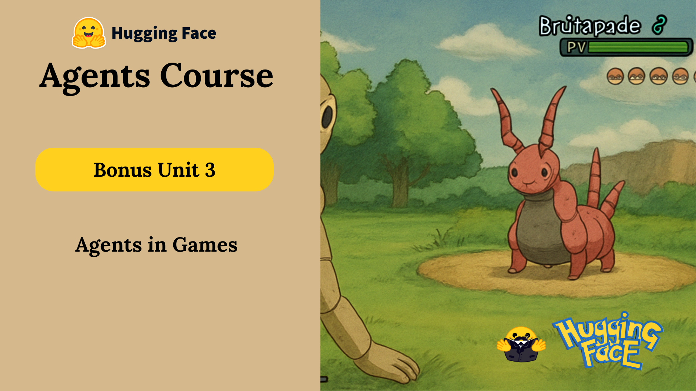

# 🎮 Bonus Unit 3: AI Agents in Games

Welcome to the bonus unit where we explore how AI agents are revolutionizing the gaming industry! This unit combines the power of LLMs with game development to create intelligent, adaptive NPCs and gameplay experiences.

## 📚 Course Progress

### ✅ Completed Units
- [x] Bonus Unit 3.1: [Introduction & LLMs in Games](./Intro-&-LLMs-in-Games.md) – Understanding AI in gaming
- [x] Bonus Unit 3.2: [LLMs to AI Agents](./LLMs-to-AI-Agents.md) – Building game agents
- [x] Bonus Unit 3.3: [Pokemon Battle Agent](./Pokemon-Battle-Agent.md) – Creating battle agents
- [x] Bonus Unit 3.4: [Launching Pokemon Agent](./Launching-Pokemon-Agent.md) – Deploying game agents

## 📌 Units Breakdown

### Bonus Unit 3.1: **Introduction & LLMs in Games**
- Understanding AI in gaming
- LLM applications in games
- Current state of AI gaming
- Future possibilities
- [Start Learning →](./Intro-&-LLMs-in-Games.md)

### Bonus Unit 3.2: **LLMs to AI Agents**
- Converting LLMs to game agents
- Agent architecture for games
- Decision-making systems
- Game state management
- [Start Learning →](./LLMs-to-AI-Agents.md)

### Bonus Unit 3.3: **Pokemon Battle Agent**
- Building battle mechanics
- Turn-based combat systems
- Strategy implementation
- Agent training and optimization
- [Start Learning →](./Pokemon-Battle-Agent.md)

### Bonus Unit 3.4: **Launching Pokemon Agent**
- Deployment strategies
- Performance optimization
- User interaction design
- Testing and evaluation
- [Start Learning →](./Launching-Pokemon-Agent.md)

## 🤖 When to Use AI Agents in Games

📋 Click to expand

Use AI agents in games when:

- You need **dynamic NPC behavior**
- You want **adaptive gameplay**
- You're building **story-driven experiences**
- You need **intelligent opponents**
- You want to create **emergent gameplay**

Skip it when:
- Your game has simple, static interactions
- You need predictable, scripted behavior
- Performance is a critical constraint

## 🔧 Key Components of Game Agents

🔠Click to expand

To build effective game agents, you need:

- **LLM Integration** – For natural language understanding
- **Game State Management** – To track and respond to game events
- **Decision Making System** – For intelligent action selection
- **Memory System** – To maintain context and history
- **Response Generation** – For natural interaction
- **Performance Optimization** – To ensure smooth gameplay

## 🎯 Learning Objectives

- [x] Understand AI applications in gaming
- [x] Build LLM-powered game agents
- [x] Implement battle mechanics
- [x] Create adaptive NPCs
- [x] Deploy game agents
- [x] Optimize agent performance

## 📚 Additional Resources

- [Machine Learning for Games Course](https://hf.co/learn/ml-games-course)
- [AI Playbook for Game Developers](https://thomassimonini.substack.com/)
- [Claude plays Pokémon Project](https://github.com/Anthropic/claude-plays-pokemon)
- [Game AI Research Papers](https://www.gamasutra.com/ai/)
- [Unity ML-Agents](https://github.com/Unity-Technologies/ml-agents)

