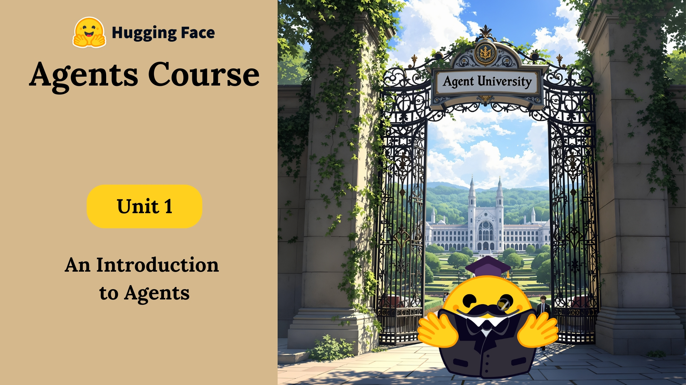

# <a href="https://hf.co/learn/agents-course" target="_blank">The Hugging Face Agents Course</a>

## 🎯 Course Overview
This repository contains my personal documentation and learning journey through the [Hugging Face Agents Course](https://huggingface.co/learn/agents-course). I'm documenting my progress, notes, and implementations as I work through the course materials.

---

## 📚 Course Progress

### ✅ Completed Units
- [x] [Unit 0: Welcome to the Course](Unit-0-Welcome/README.md)
- [x] [Unit 1: Introduction to Agents](Unit-1-Intro-to-Agents/README.md)
- [x] [Unit 2: Frameworks for AI Agents](Unit-2-Framework-for-AI-Agents/README.md)
- [x] [Unit 3: Use Cases for Agent RAG](Unit-3-Usecase-for-Agent-RAG/README.md)
- [x] [Unit 4: Final Project](Unit-4-Final-Project/README.md)
- [x] [Bonus Unit 1: Fine-Tuning an LLM for Function-Calling](Bonus-Unit-1-Fine-Tunning/README.md)
- [x] [Bonus Unit 2: Agent Observability and Evaluation](Bonus-Unit-2-Agent-Observability-Evaluation/README.md)
- [x] [Bonus Unit 3: Agents in Games with Pokemon](Bonus-Unit-3-Agents-in-Games/README.md)

## 📝 Unit Structure

### [Unit 1: Introduction to Agents](Unit-1-Intro-to-Agents/README.md)
- [x] [What is an Agent?](Unit-1-Intro-to-Agents/What-is-an-Agent?.md)
- [x] [Understanding LLMs](Unit-1-Intro-to-Agents/What-are-LLMs?.md)
- [x] [Messages and Special Token](Unit-1-Intro-to-Agents/Messages-and-Special-Tokens.md)
- [x] [Tools](Unit-1-Intro-to-Agents/What-are-Tools?.md)
- [x] [Agent Workflow](Unit-1-Intro-to-Agents/AI-Agent-Workflow.md)
- [x] [Agent Thought](Unit-1-Intro-to-Agents/AI-Agent-Workflow.md)
- [x] [Agent Action](Unit-1-Intro-to-Agents/Actions.md)
- [x] [Agent Observation](Unit-1-Intro-to-Agents/Observe.md)
- [x] [Agent Framework](Unit-1-Intro-to-Agents/Dummy-Agent-LIbrary.md)
- [x] [Building Your First Agent](Unit-1-Intro-to-Agents/Agent.md)

### [Unit 2: Frameworks for AI Agents](Unit-2-Framework-for-AI-Agents/README.md)
- [x] [smolagents Framework](Unit-2-Framework-for-AI-Agents/Unit-2.1-Smolagents/README.md)
- [x] [LlamaIndex Framework](Unit-2-Framework-for-AI-Agents/Unit-2.2-LlamaIndex/README.md)
- [x] [LangGraph Framework](Unit-2-Framework-for-AI-Agents/Unit-2.3-LangGraph/README.md)

### [Unit 3: Use Cases for Agent RAG](Unit-3-Usecase-for-Agent-RAG/README.md)
- [x] [Creating RAG Tool](Unit-3-Usecase-for-Agent-RAG/Creating-RAG-Tool.md)
- [x] [Building and Integrating Tools](Unit-3-Usecase-for-Agent-RAG/Building-and-Integrating-Tools-for-Agent.md)
- [x] [Creating Gala Agent](Unit-3-Usecase-for-Agent-RAG/Creating-Gala-Agent.md)
- [x] [Agentic RAG](Unit-3-Usecase-for-Agent-RAG/Agentic-RAG.md)

### [Unit 4: Final Project](Unit-4-Final-Project/README.md)
- [x] [Understanding GAIA](Unit-4-Final-Project/What%20is%20GAIA?.md)
- [x] [Building Final Agent](Unit-4-Final-Project/Final-Hands-On.md)
- [x] [Project Submission](Unit-4-Final-Project/Final-Hands-On.md)
- [x] [Course Conclusion](Unit-4-Final-Project/Conclustion.md)

### [Bonus Unit 1: Fine-Tuning LLMs for Functional-Calling](Bonus-Unit-1-Fine-Tunning/README.md)
- [x] [Functional Calling](Bonus-Unit-1-Fine-Tunning/Function-Calling.md)
- [x] [Fine-Tuning LLMs for Functional Calling](Bonus-Unit-1-Fine-Tunning/Fine-Tune-for-Function-Calling.md)

### [Bonus Unit 2: Agent Observability and Evaluation](Bonus-Unit-2-Agent-Observability-Evaluation/README.md)
- [x] [Agent Observability and Evaluation](Bonus-Unit-2-Agent-Observability-Evaluation/AI-Agent-Observability-&-Evaluation.md)
- [x] [Monitoring and Evaluating Agent ](Bonus-Unit-2-Agent-Observability-Evaluation/Obervability-&-Evaluation-of-Agents.md)

### [Bonus Unit 3: Agents in Game](Bonus-Unit-3-Agents-in-Games/README.md)
- [x] [AI Agents in Games with Pokemon](Bonus-Unit-3-Agents-in-Games/Intro-&-LLMs-in-Games.md)
- [x] [State of the Art in Using LLMs in Game](Bonus-Unit-3-Agents-in-Games/Intro-&-LLMs-in-Games.md)
- [x] [LLMs to AI Agents](Bonus-Unit-3-Agents-in-Games/LLMs-to-AI-Agents.md)
- [x] [Pokemon Battle Agent](Bonus-Unit-3-Agents-in-Games/Pokemon-Battle-Agent.md)
- [x] [Launching Game Agent](Bonus-Unit-3-Agents-in-Games/Launching-Pokemon-Agent.md)

---

### 🏆 Final Project
Check out my successful implementation:
[RobotPai - AI Agent](https://huggingface.co/spaces/kishan-patel-dev/RobotPai/tree/main)

---

## 🎓 Certificate

Complete the course and pass the final project to earn your certificate!

If you scored **above 30%**, congratulations — you're eligible to claim your **official certificate** of completion! 🏅

👉 I proudly earned mine with a 🏆 top-tier score **above 90%** !

.webp)

📄 [**View Certificate PDF**](certificate.pdf)

--- 

## 🔍 Additional Resources

### 📚 Recommended Reading
- [Hugging Face Agent Course](https://huggingface.co/learn/agents-course/)
- [The ReAct Paper](https://arxiv.org/abs/2210.03629)
- [smolagents Documentation](https://github.com/smol-ai/smolagents)
- [LlamaIndex Documentation](https://docs.llamaindex.ai/)
- [LangGraph Documentation](https://python.langchain.com/docs/langgraph)
- [Hugging Face Spaces Guide](https://huggingface.co/docs/hub/spaces)

### 🛠️ Useful Tools
- [Hugging Face Hub](https://huggingface.co/)
- [Gradio](https://gradio.app/)
- [Python Documentation](https://docs.python.org/3/)

## 📝 About This Repository
This repository serves as my personal documentation of the [Hugging Face Agents Course](https://huggingface.co/learn/agents-course). Here, I:
- Document my learning journey
- Share my implementations
- Track my progress
- Store my notes and resources

---

## 👨‍💻 About Me
**KISHAN PATEL** — Ideas to **REALITY** | OSS Contributor | GSoC'25 Aspirant

- 🚀 Passionate about turning ideas into impactful software, automating workflows, and driving innovation in open-source communities.

- 💡 Currently building **AI Agents** and **Generative AI Projects** with a focus on real-world usability and scalability.

- 🧠 Exploring the frontier of **Generative AI**, **Autonomous Agents**, and **LLM-driven systems**, while sharpening my expertise in **full-stack web development** — from pixel-perfect UIs to resilient backend APIs.

- 🤝 Active contributor to [Rocket.Chat](https://github.com/rocketChat/) and [Openlit](https://github.com/openlit/), with a commitment to collaborative problem-solving and continuous learning.

- 🧰 Favorite tools & tech: TypeScript, Node.js, MongoDB, Express, LLMs, and LangGraph frameworks.

🌐 Let's connect:

*[GitHub](https://github.com/Kishan-Patel-dev)*    ||     *[LinkedIn](https://www.linkedin.com/in/kishan-patel-dev)*    ||    *[X (Twitter)](https://x.com/KishanPatel_dev)*

---

## 🚀 Next Steps
- Continue exploring AI Agents and their applications
- Contribute to open-source AI projects
- Build more sophisticated agents
- Share knowledge with the community

Feel free to explore my implementations and learn from my journey! 🌟
