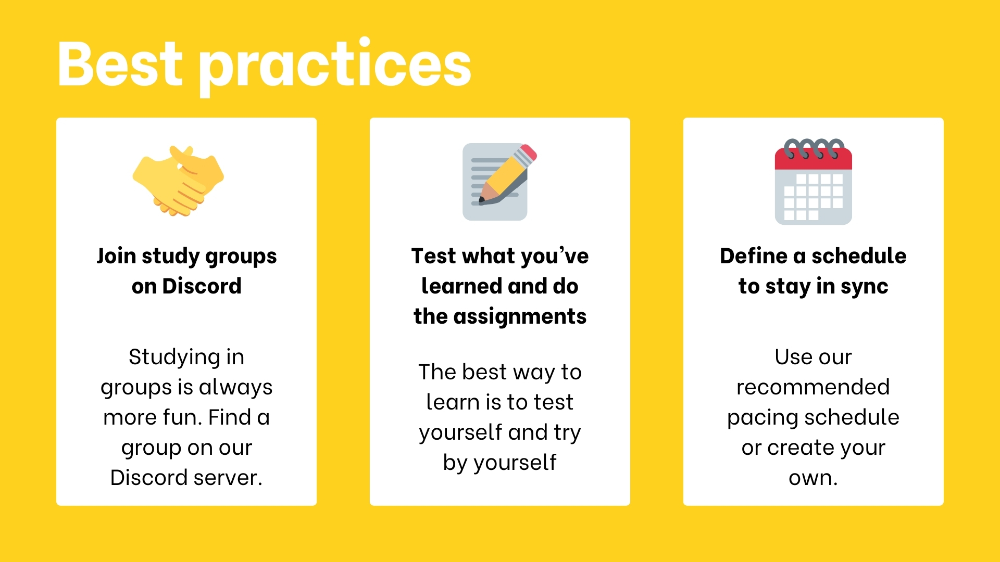
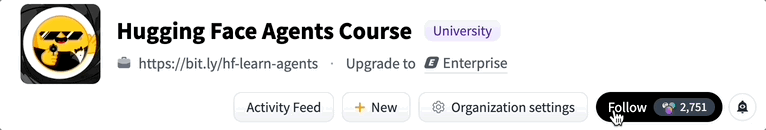

# Unit 0 — Welcome to the Course


## 🎯 What to expect from this course?

In this course, you will:

- 📖 Study AI Agents in theory, design, and practice.
- 🧑‍💻 Learn to use established AI Agent libraries such as **smolagents**, **LlamaIndex**, and **LangGraph**.
- 💾 Share your agents on the Hugging Face Hub and explore agents created by the community.
- 🏆 Participate in challenges where you will evaluate your agents against others.
- 🎓 Earn a certificate of completion by completing assignments.

At the end of this course, you’ll understand **how Agents work** and **how to build your own Agents** using the latest libraries and tools.

---

## 📚 What does the course look like?

The course is composed of:

- **Foundational Units**: Learning Agent concepts in theory.
- **Hands-on Practice**: Using established AI Agent libraries (via Hugging Face Spaces).
- **Use Case Assignments**: Solve real-world problems.
- **Final Challenge**: Compete your agent against others, with a leaderboard.

This course is a **living project**, evolving with feedback!  
You are encouraged to open GitHub issues/PRs and participate in Discord discussions.

[GitHub Repository Link](https://github.com/huggingface/agents-course)

---

## 📖 Syllabus Overview

| Chapter | Topic | Description |
|:-------:|:-----:|:----------- |
| 0 | Onboarding | Set up the tools and platforms needed |
| 1 | Agent Fundamentals | Concepts like Tools, Thoughts, Actions, Observations, LLMs, and simple function-based agents |
| 1.5 | Bonus: Fine-tuning for function calling | Fine-tune an LLM with LoRA for function calling |
| 2 | Frameworks | Learn popular libraries: smolagents, LangGraph, LlamaIndex |
| 2.5 | Bonus: Observability and Evaluation | Learn tracing and evaluation for production |
| 3 | Use Cases | Build real-world AI Agent use cases |
| 4 | Final Assignment | Build an agent for benchmarks and compete 🚀 |

---

## 🛠 Tools Needed

- A computer with internet connection
- A Hugging Face account (free)

---

## 🏆 Certifications


- **Fundamentals Certificate**: Complete Unit 1
- **Full Course Certificate**: Complete Unit 1 + one Use Case Assignment + the Final Challenge

**Deadline**: All assignments must be finished before **July 1st, 2025**.


---

## 📅 How to get the most out of the course



- Join study groups on Discord
- Actively do quizzes and assignments
- Define and follow a learning schedule (recommend pace provided by course)

---

# 🚀 Let's begin!

**Step 1: Create Your Hugging Face Account**
(If you haven’t already) create a [Hugging Face account here](https://huggingface.co/join).

**Step 2: Join Our Discord Community**
👉🏻 [Join our discord server here](https://discord.gg/UrrTSsSyjb).

When you join, remember to introduce yourself in #introduce-yourself.

We have multiple AI Agent-related channels:

- **agents-course-announcements**: for the latest course information.
- **🎓-agents-course-general**: for general discussions and chitchat.
- **agents-course-questions**: to ask questions and help your classmates.
- **agents-course-showcase**: to show your best agents.
In addition you can check:
- **smolagents**: for discussion and support with the library.

**Step 3: Follow the Hugging Face Agent Course Organization**
Stay up to date with the latest course materials, updates, and announcements by following the Hugging Face Agents Course Organization.

👉 Go [here](https://huggingface.co/agents-course) and click on follow.



**Step 4: Share Learning Journey**:
My Learning is Documented in Github Repo:

[Github Repo](https://github.com/Kishan-Patel-dev/AI-Agent)

**Step 5: Running Models Locally with Ollama (In case you run into Credit limits)**

1. Install Ollama
    - Follow the official Instructions here.

2. Pull a model Locally
    ```
        ollama pull qwen2:7b #Check out ollama website for more models
    ```
3. Start Ollama in the background (In one terminal)
    ```
        ollama serve
    ```
4. Use LiteLLMModel Instead of HfApiModel
    ```
        from smolagents import LiteLLMModel

        model = LiteLLMModel(
            model_id="ollama_chat/qwen2:7b",  # Or try other Ollama-supported models
            api_base="http://127.0.0.1:11434",  # Default Ollama local server
            num_ctx=8192,
        )
    ```
5. Why this works?

- Ollama serves models locally using an OpenAI-compatible API at http://localhost:11434.
- LiteLLMModel is built to communicate with any model that supports the OpenAI chat/completion API format.
- This means you can simply swap out HfApiModel for LiteLLMModel no other code changes required. It’s a seamless, plug-and-play solution.

Congratulations! 🎉 You’ve completed the onboarding process! You’re now ready to start learning about AI Agents. Have fun!