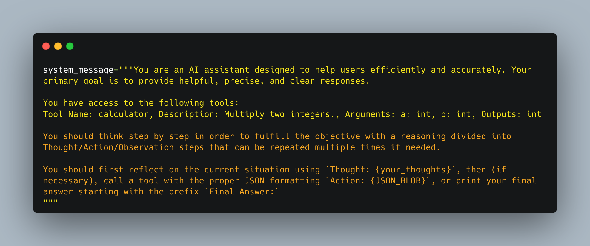

# 🤖 Understanding AI Agents: The Thought-Action-Observation Cycle

## 📝 Overview
AI Agents are systems capable of reasoning, planning, and interacting with their environment through a continuous cycle of thought, action, and observation.

## 🔄 Core Components

**Agents work in a continuous cycle of: thinking (Thought) → acting (Act) and observing (Observe).**


1. **Thought**: The LLM part of the Agent decides what the next step should be.
2. **Action**: The agent takes an action, by calling the tools with the associated arguments.
3. **Observation**: The model reflects on the response from the tool.

In many Agent frameworks, **the rules and guidelines are embedded directly into the system prompt**, ensuring that every cycle adheres to a defined logic.


## 🧠 Thought: Internal Reasoning and the ReAct Approach

### Understanding the Thought Process

Thoughts represent the **Agent's internal reasoning and planning processes** to solve tasks. This utilizes the agent's Large Language Model (LLM) capacity **to analyze information when presented in its prompt**.

Think of it as the agent's internal dialogue, where it:
- Considers the task at hand
- Strategizes its approach
- Accesses current observations
- Decides next actions
- Breaks down complex problems
- Reflects on past experiences
- Adjusts plans based on new information

### Types of Thoughts

| Type of Thought | Example |
|-----------------|---------|
| Planning | "I need to break this task into three steps: 1) gather data, 2) analyze trends, 3) generate report" |
| Analysis | "Based on the error message, the issue appears to be with the database connection parameters" |
| Decision Making | "Given the user's budget constraints, I should recommend the mid-tier option" |
| Problem Solving | "To optimize this code, I should first profile it to identify bottlenecks" |
| Memory Integration | "The user mentioned their preference for Python earlier, so I'll provide examples in Python" |
| Self-Reflection | "My last approach didn't work well, I should try a different strategy" |
| Goal Setting | "To complete this task, I need to first establish the acceptance criteria" |
| Prioritization | "The security vulnerability should be addressed before adding new features" |

> 💡 **Note**: In LLMs fine-tuned for function-calling, the thought process is optional. More details about function-calling will be covered in the Actions section.

### The ReAct Approach
The ReAct approach combines "Reasoning" (Think) with "Acting" (Act). It's a prompting technique that:
- Appends "Let's think step by step" before LLM decoding
- Encourages step-by-step problem decomposition
- Leads to fewer errors by considering sub-steps in detail
- Helps generate plans rather than jumping to final solutions

#### Modern Developments
Recent advances in reasoning strategies include:
- Deepseek R1
- OpenAI's o1
- Models fine-tuned to "think before answering"
- Special tokens (`<think>` and `</think>`) for structured thinking
- Training methods based on thousands of examples

### 1. 💭 Thought
- The LLM component of the Agent
- Responsible for decision-making about next steps
- Involves internal reasoning and problem breakdown
- Example: "I need to check the current weather for New York"

### 2. ⚡ Action
- Execution of decisions through tool calls
- Requires proper formatting of commands
- Includes specific parameters for tool usage
- Example: Calling a weather API with location parameters

### 3. 👀 Observation
- Receives feedback from the environment
- Processes tool responses
- Updates internal context
- Example: Receiving weather data from API

## 🌟 The Cycle in Practice: Alfred the Weather Agent

### Process Flow
1. **Initial Thought** 🧠
   - Receives user query
   - Plans necessary steps
   - Identifies required tools

2. **Action** 🚀
   - Formats tool call
   - Executes API request
   - Example: `get_weather` with location parameter

3. **Observation** 📊
   - Receives weather data
   - Processes response
   - Updates context

4. **Final Thought & Action** 🎯
   - Compiles information
   - Formats user response
   - Delivers final answer

## 🔑 Key Characteristics

### 1. 🔄 Continuous Loop
- Cycle repeats until objective is fulfilled
- Similar to a while loop in programming
- Allows for error correction and refinement

### 2. 🛠️ Tool Integration
- Enables real-time data access
- Extends beyond static knowledge
- Provides dynamic capabilities

### 3. 🔄 Dynamic Adaptation
- Incorporates new information
- Refines responses based on feedback
- Ensures accuracy and relevance

## ⚙️ Implementation
- Rules and guidelines embedded in system prompt
- Tools defined and made available to agent
- Cycle instructions baked into LLM

## ✨ Benefits
1. 🔄 Iterative problem-solving
2. 📡 Real-time data access
3. 🔄 Adaptive responses
4. 🛠️ Error correction capability
5. 📈 Continuous improvement

## 🎯 Practical Applications
- 🌤️ Weather information retrieval
- 📊 Data processing
- 🤖 Task automation
- ⚡ Real-time decision making
- 🧩 Complex problem solving

## 🎮 Interactive Exercise
Try to identify the Thought-Action-Observation cycle in this scenario:
```
User: "What's the weather like in Tokyo?"
Agent: [Your turn! Break down the steps]
```

## 📚 Further Reading
This cycle forms the foundation of the ReAct (Reasoning and Acting) framework, which we'll explore in more detail in subsequent sections.

---