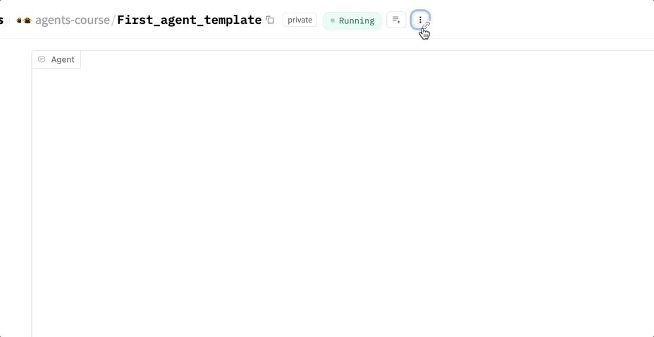

# 🤖 Build Your First AI Agent with smolagents

## 📝 Overview
Learn how to create a functional AI agent using [smolagents](https://github.com/smol-ai/smolagents). You'll:
- ✅ Create tools your agent can use
- ✅ Build a `CodeAgent` powered by a state-of-the-art LLM
- ✅ Deploy it on [Hugging Face Spaces](https://huggingface.co/spaces)
- ✅ Learn how the think → act → observe loop works

## 🚀 Quick Start

### 1. Setup
1. Duplicate the template space: [First Agent Template](https://huggingface.co/spaces/agents-course/First_agent_template)
   
2. Add your Hugging Face API token:
   - Get token from https://hf.co/settings/tokens
   - Add to Space Settings > Variables and Secrets
   - Name: `HF_TOKEN`

## 🧠 What is smolagents?
- A lightweight Python library for building agents
- Uses code blocks ("tools") and LLMs
- Implements think → act → observe cycles
- Simplifies agent development process

## 🔧 Implementation

### 1. Project Structure
```
smolagents-first-agent/
│
├── app.py
├── prompts.yaml
├── Gradio_UI.py
├── tools/
│   └── final_answer.py
│
└── README.md
```

### 2. Core Components

#### Required Imports
```python
from smolagents import CodeAgent, DuckDuckGoSearchTool, FinalAnswerTool, HfApiModel, load_tool, tool
import datetime
import requests
import pytz
import yaml
from Gradio_UI import GradioUI
```

#### Model Configuration
```python
final_answer = FinalAnswerTool()
model = HfApiModel(
    max_tokens=2096,
    temperature=0.5,
    model_id='Qwen/Qwen2.5-Coder-32B-Instruct',
    custom_role_conversions=None,
)

with open("prompts.yaml", 'r') as stream:
    prompt_templates = yaml.safe_load(stream)
```

### 3. Building Tools

#### Custom Tool Template
```python
@tool
def my_custom_tool(arg1: str, arg2: int) -> str:
    """A tool that does nothing yet 
    Args:
        arg1: the first argument
        arg2: the second argument
    """
    return "What magic will you build ?"
```

#### Time Zone Tool
```python
@tool
def get_current_time_in_timezone(timezone: str) -> str:
    """Fetches current local time in a timezone.
    Args:
        timezone: A string (e.g., 'Asia/Kolkata')
    """
    try:
        tz = pytz.timezone(timezone)
        local_time = datetime.datetime.now(tz).strftime("%Y-%m-%d %H:%M:%S")
        return f"Current time in {timezone}: {local_time}"
    except Exception as e:
        return f"Error: {str(e)}"
```

### 4. Creating the Agent
```python
agent = CodeAgent(
    model=model,
    tools=[final_answer], # add your tools here (don't remove final_answer)
    max_steps=6,
    verbosity_level=1,
    grammar=None,
    planning_interval=None,
    name=None,
    description=None,
    prompt_templates=prompt_templates
)

GradioUI(agent).launch()
```

## 🎯 Tool Ideas
- `weather_tool(city: str)`: Get live weather via API
- `image_caption_tool(url: str)`: Describe an image
- `translate_tool(text: str, target_lang: str)`: Translate phrases

## 💡 Best Practices
1. Always specify return types for tools
2. Provide clear docstrings for arguments
3. Include error handling in tools
4. Test tools thoroughly before deployment
5. Keep the agent's behavior focused

## 🚀 Deployment
1. Test your agent locally in the Hugging Face Space
2. Publish your space
3. Share your creation in #agents-course-showcase

## 📚 Resources
- [smolagents GitHub](https://github.com/smol-ai/smolagents)
- [Hugging Face Spaces](https://huggingface.co/spaces)
- [Prompt Engineering Guide](https://www.promptingguide.ai/)

## 🎯 Key Takeaways
1. smolagents simplifies agent development
2. Tools are the building blocks of agent capabilities
3. System prompts guide agent behavior
4. Error handling is crucial
5. Experimentation leads to better agents

---