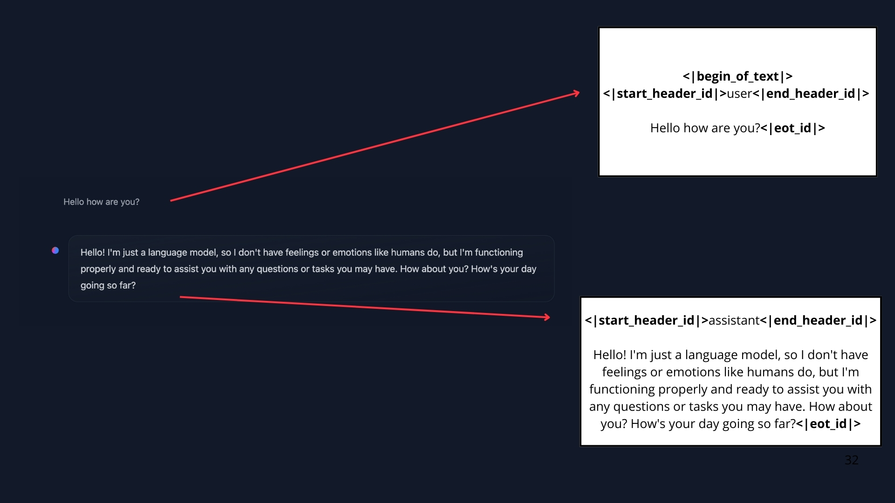

# 💬 Message & Special Tokens

### 🌟 1. Messages vs. Prompts
- In UI (like ChatGPT or HuggingChat), you interact using *messages* (`user`, `assistant`, etc.).
- But **before sending to the LLM**, **all messages are concatenated into a single prompt** (a big text sequence).
- The LLM **does not remember** conversations between calls — it reads *everything* each time.


*We see here the difference between what we see in UI and the prompt fed to the model.*
---

### 🌟 2. Chat Templates
- **Chat templates** format the list of messages into the prompt string the model expects.
- **Bridge between conversational messages (user and assistant turns) and the specific formatting requirements** of your chosen LLM.
- Different LLMs (SmolLM, Llama3, etc.) have **different formatting rules** and **special tokens** (like `<|im_start|>`, `<|eot_id|>`, etc.).
- Templates ensure the model understands where user turns and assistant turns are.

Examples:
- **SmolLM2 format**:
  ```
  <|im_start|>user
  Message
  <|im_end|>
  ```
- **Llama 3.2 format**:
  ```
  <|start_header_id|>user<|end_header_id|>
  Message
  <|eot_id|>
  ```

---

### 🌟 3. Special Roles: System Messages
- **System messages** set instructions or behavior ("You are a helpful assistant", "You are a rebel agent", etc.).
- They’re usually the first message.
- **Tools, formatting rules, and thought process segmentation** are often introduced in the system message.

---

### 🌟 4. Base Models vs. Instruct Models
| Base Model | Instruct Model |
|:----------|:----------------|
| Only trained on raw text. | Fine-tuned to follow instructions. |
| Predicts next token without special behavior. | Responds properly to instructions/conversations. |
| Needs *carefully structured prompts* to act conversationally. | Understands chat behavior naturally. |

---

### 🌟 5. How to Convert Messages into a Prompt
- Use **transformers** `apply_chat_template()`:
  ```python
  from transformers import AutoTokenizer
  
  tokenizer = AutoTokenizer.from_pretrained("HuggingFaceTB/SmolLM2-1.7B-Instruct")
  rendered_prompt = tokenizer.apply_chat_template(messages, tokenize=False, add_generation_prompt=True)
  ```
- `rendered_prompt` is the correctly formatted text you feed into the LLM.

---

### 🌟 6. Summary
- Always **structure your messages** (`role`, `content`) correctly.
- **Let the tokenizer handle** the conversion into the full prompt via its **chat_template**.
- Correct templating is **essential** to getting reliable behavior, especially when using different models (each might have different templates and special tokens).

---

### 🎯 Key takeaway:
👉 Messages (in ChatML or similar format) + Chat Templates → Prompt → Model Input.  
👉 Always use the **right chat template** for the model you’re targeting!

---