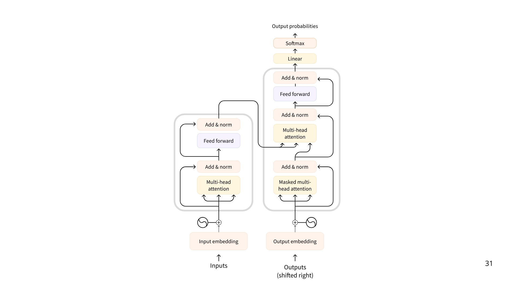

# 🧠 **What are LLMs?**
LLMs (Large Language Models) are **AI models trained to understand and generate human language**.  
They are the **core of modern AI agents**.

---

# 📚 **Main Concepts Covered:**

### 1. **Definition of LLMs**
- **Large Language Model (LLM)** = an AI model trained on huge text datasets.
- Learns **patterns**, **structures**, **nuances** of language.
- Built with **millions to billions of parameters**.

---

### 2. **The Transformer Architecture**

- Most LLMs nowadays are **built on the Transformer architecture** a deep learning architecture based on the **“Attention”** algorithm, that has gained significant interest since the release of BERT from Google in 2018.

*The original Transformer architecture looked like this, with an encoder on the left and a decoder on the right.*

The base for almost all modern LLMs:
- Introduced in 2017 (paper: *Attention is All You Need*).
- Core idea: **Attention** → focus on the most relevant parts of the input.

**Three types of Transformer models:**
| Type      | Purpose | Example Models | Use Case |
|-----------|---------|----------------|----------|
| Encoder   | Analyze input | BERT | Search, classification |
| Decoder   | Generate output | Llama, GPT-4 | Chatbots, content generation |
| Encoder–Decoder (Seq2Seq) | Translate input to output | T5, BART | Translation, summarization |

---

### 3. **Popular LLMs**
Some examples:
- GPT-4 (OpenAI)
- Llama 3 (Meta)
- Gemma (Google)
- Mistral (Mistral AI)
- Deepseek-R1 (DeepSeek)

---

### 4. **How LLMs Work: Autoregressive Prediction**
- They predict **one token at a time**.
- Keep predicting until a special **EOS (End of Sequence)** token appears.
- Example: “The capital of France is … [Paris]”

**Token ≠ Word** → tokens can be parts of words (“interest” + “ing”).

---

### 5. **Special Tokens**
Each model uses **special markers** to start/end prompts or messages.

| Model       | Provider                   | EOS Token             | Functionality                   |
|-------------|-----------------------------|-----------------------|---------------------------------|
| GPT-4       | OpenAI                      | `<endoftext`           | End of message text             |
| Llama 3     | Meta (Facebook AI Research) | `<eot_id`              | End of sequence                 |
| DeepSeek-R1 | DeepSeek                    | `<end_of_sentence`     | End of message text             |
| SmolLM2     | Hugging Face                | `<im_end`              | End of instruction or message   |
| Gemma       | Google                      | `<end_of_turn>`        | End of conversation turn        |

(You don't need to memorize them, just understand they exist.)

---

### 6. **Decoding Strategies**
When choosing the next token:
- **Greedy decoding** → always pick the highest probability.
- **Beam search** → explore multiple possible futures to choose the best overall.

- LLMs are said to be **autoregressive**, meaning that **the output from one pass becomes the input for the next one**. This loop continues until the model predicts the next token to be the EOS token, at which point the model can stop.

---

### 7. **Attention Mechanism**
- LLMs **pay attention** to important parts of the text while predicting the next token.

- E.g., In "The capital of France is...", words like "capital" and "France" are more important.

---

### 8. **Prompting**
- The **input you give** is called a **prompt**.
- A good prompt helps the model produce better answers.

---

### 9. **Training LLMs**
- **Pretraining:** Predict next tokens on huge datasets (self-supervised learning).
- **Fine-tuning:** Further train for specific tasks (like chatting, coding, summarization).

---

### 10. **Using LLMs**
You can:
- **Run locally** (if you have powerful hardware).
- **Use API services** (like Hugging Face or OpenAI APIs).

---

### 11. **LLMs in AI Agents**
LLMs are the **"brain"** of AI Agents:
- **Understand** instructions.
- **Maintain** conversation memory.
- **Plan** actions.
- **Decide** which tools to use.

---

# 🛠️ **Next Steps**
You’ll start learning:
- How **LLMs** structure responses in **conversations**.
- How to **connect** with real LLMs (like Llama 3) using **APIs** (e.g., Hugging Face).

---

# ⭐ Short Summary
> **LLMs predict the next token based on the input tokens, using attention to focus on the most relevant parts of the input. They power AI agents by providing language understanding and generation.**
