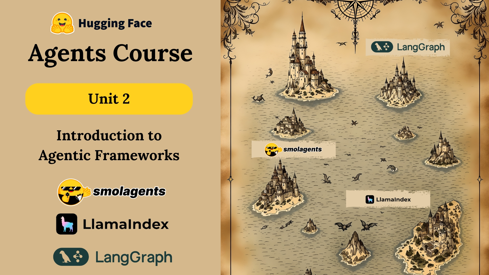

# 🧠 Introduction to Agentic Frameworks
This unit focuses on **agentic frameworks** tools designed to help you build more flexible and powerful applications powered by LLMs.

## 📌 Units Breakdown:

### Unit 2.1: **smolagents** – Hugging Face’s lightweight agent framework.

### Unit 2.2: **LlamaIndex** – Context-augmented agent system with production-ready tools.

### Unit 2.3: **LangGraph** – Framework for building stateful agent workflows.

## 🤖 When to Use an Agentic Framework

- You have **complex workflows** (e.g., multiple tool calls, dynamic decision-making).

- You need **abstractions** for better orchestration and modularity.

- You **require features** like memory, retry logic, and error handling.

## ❌ Skip It When:

- You only need a simple prompt chain.

- Predefined workflows are sufficient.

- You want full control with less overhead.

## 🔧 Key Components of Agentic Systems

To build robust agentic apps, the following pieces are typically needed:

- **LLM Engine** – The core brain that generates outputs.

- **Tools List** – Functions or APIs the agent can use.

- **Tool Call Parser** – Extracts actions from LLM output.

- **System Prompt** – Coordinates agent behavior with the parser.

- **Memory** – For retaining past interactions.

- **Error Handling** – Retries, logs, and corrections for failed calls.

