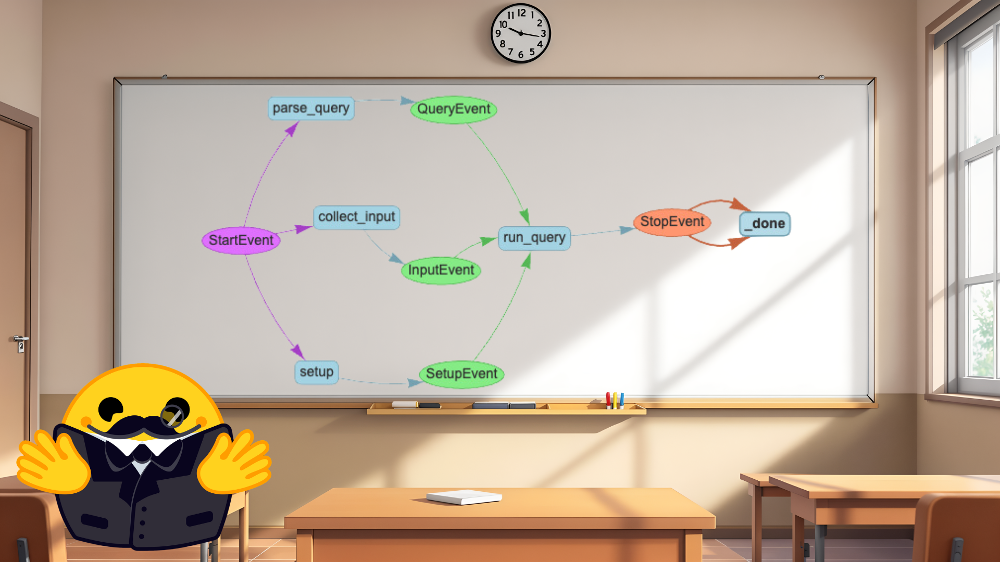
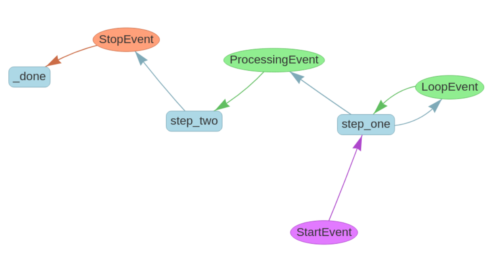

# 🧠 Creating Agentic Workflows in LlamaIndex

<a href="./workflows.ipynb" target="_blank">
  
</a>

Workflows in LlamaIndex allow you to structure your code into **sequential, manageable, and event-driven steps**, perfect for Retrieval-Augmented Generation (RAG) and complex agent interactions.



---

## 🚦 Benefits of LlamaIndex Workflows

- Clear organization into discrete steps
- Event-driven architecture
- Type-safe communication between steps
- Built-in state management
- Support for both simple and agent-based workflows

Workflows strike a great balance between the autonomy of agents while maintaining control over the overall workflow.
---

## 🔧 Basic Workflow Creation

**Install Workflow Package**
```python
pip install llama-index-utils-workflow
```
**Workflow**
```python
from llama_index.core.workflow import StartEvent, StopEvent, Workflow, step

class MyWorkflow(Workflow):
    @step
    async def my_step(self, ev: StartEvent) -> StopEvent:
        # do something here
        return StopEvent(result="Hello, world!")


w = MyWorkflow(timeout=10, verbose=False)
result = await w.run()
```
**Running Worflow**
```python
w.run();
```
---

## 🔗 Multi-Step Workflow with Custom Events
- To connect multiple steps, we **create custom events that carry data between steps**. 

To do so, we need to add an `Event` that is passed between the steps and transfers the output of the first step to the second step.

```python
from llama_index.core.workflow import Event

class ProcessingEvent(Event):
    intermediate_result: str

class MultiStepWorkflow(Workflow):
    @step
    async def step_one(self, ev: StartEvent) -> ProcessingEvent:
        # Process initial data
        return ProcessingEvent(intermediate_result="Step 1 complete")

    @step
    async def step_two(self, ev: ProcessingEvent) -> StopEvent:
        # Use the intermediate result
        final_result = f"Finished processing: {ev.intermediate_result}"
        return StopEvent(result=final_result)

w = MultiStepWorkflow(timeout=10, verbose=False)
result = await w.run()
result
```

---

## 🔁 Loops and Branches in Workflows
- The type hinting is the most powerful part of workflows because it allows us to create branches, loops, and joins to facilitate more complex workflows.


```python
from llama_index.core.workflow import Event
import random


class ProcessingEvent(Event):
    intermediate_result: str


class LoopEvent(Event):
    loop_output: str


class MultiStepWorkflow(Workflow):
    @step
    async def step_one(self, ev: StartEvent | LoopEvent) -> ProcessingEvent | LoopEvent:
        if random.randint(0, 1) == 0:
            print("Bad thing happened")
            return LoopEvent(loop_output="Back to step one.")
        else:
            print("Good thing happened")
            return ProcessingEvent(intermediate_result="First step complete.")

    @step
    async def step_two(self, ev: ProcessingEvent) -> StopEvent:
        # Use the intermediate result
        final_result = f"Finished processing: {ev.intermediate_result}"
        return StopEvent(result=final_result)


w = MultiStepWorkflow(verbose=False)
result = await w.run()
result
```

---

## 🗂 Drawing the Workflow
- Using `draw_all_possible_flows` function to draw the workflow & store in .html file.

```python
from llama_index.utils.workflow import draw_all_possible_flows

w = ... # as defined in the previous section
draw_all_possible_flows(w, "flow.html")
```

---

## 🧠 State Management with `Context`
- State management is useful when you want to keep track of the state of the workflow, so that every step has access to the same state.
- Using the `Context` type hint on top of a parameter in the `@step` function.

```python
from llama_index.core.workflow import Context

async def query(self, ctx: Context, ev: StartEvent) -> StopEvent:
    await ctx.set("query", "What is the capital of France?")
    query = await ctx.get("query")
    return StopEvent(result=query)
```
---

## 🤖 Automating with Multi-Agent Workflows

Use `AgentWorkflow` with `ReActAgent` for collaborative agentic systems.

- **`AgentWorkflow` class to create a multi-agent workflow.**
- The `AgentWorkflow` uses Workflow Agents to allow you to create a system of one or more agents that can collaborate and hand off tasks to each other based on their specialized capabilities.
- One agent must be designated as the root agent in the `AgentWorkflow` constructor

**Multi-Agent Workflow**
```python
from llama_index.core.agent.workflow import AgentWorkflow, ReActAgent
from llama_index.llms.huggingface_api import HuggingFaceInferenceAPI

# Define some tools
def add(a: int, b: int) -> int:
    """Add two numbers."""
    return a + b

def multiply(a: int, b: int) -> int:
    """Multiply two numbers."""
    return a * b

llm = HuggingFaceInferenceAPI(model_name="Qwen/Qwen2.5-Coder-32B-Instruct")

# we can pass functions directly without FunctionTool -- the fn/docstring are parsed for the name/description
multiply_agent = ReActAgent(
    name="multiply_agent",
    description="Is able to multiply two integers",
    system_prompt="A helpful assistant that can use a tool to multiply numbers.",
    tools=[multiply],
    llm=llm,
)

addition_agent = ReActAgent(
    name="add_agent",
    description="Is able to add two integers",
    system_prompt="A helpful assistant that can use a tool to add numbers.",
    tools=[add],
    llm=llm,
)

# Create the workflow
workflow = AgentWorkflow(
    agents=[multiply_agent, addition_agent],
    root_agent="multiply_agent",
)

# Run the system
response = await workflow.run(user_msg="Can you add 5 and 3?")
```

---

## 🧮 Stateful Agents (Function Call Tracking Example)
- Agent tools can also modify the workflow state by providing an initial state dict that will be availabel to all agents.
- The state is stored in the state key of the workflow context. 
- It will be injected into the state_prompt which augments each new user message.

```python
from llama_index.core.workflow import Context

# Define some tools
async def add(ctx: Context, a: int, b: int) -> int:
    """Add two numbers."""
    # update our count
    cur_state = await ctx.get("state")
    cur_state["num_fn_calls"] += 1
    await ctx.set("state", cur_state)

    return a + b

async def multiply(ctx: Context, a: int, b: int) -> int:
    """Multiply two numbers."""
    # update our count
    cur_state = await ctx.get("state")
    cur_state["num_fn_calls"] += 1
    await ctx.set("state", cur_state)

    return a * b

...

workflow = AgentWorkflow(
    agents=[multiply_agent, addition_agent],
    root_agent="multiply_agent"
    initial_state={"num_fn_calls": 0},
    state_prompt="Current state: {state}. User message: {msg}",
)

# run the workflow with context
ctx = Context(workflow)
response = await workflow.run(user_msg="Can you add 5 and 3?", ctx=ctx)

# pull out and inspect the state
state = await ctx.get("state")
print(state["num_fn_calls"])
```

---

## 📚 Learn More
Explore more advanced concepts and examples in the official [LlamaIndex Documentation](https://docs.llamaindex.ai/en/stable/understanding/workflows/).
