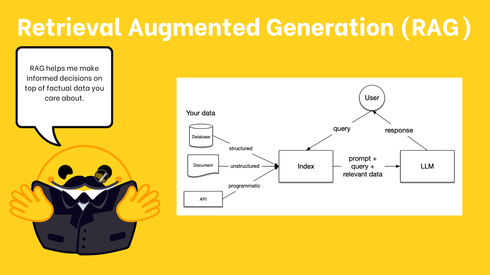

# 🧩 LlamaIndex Components & RAG Pipeline Overview

LlamaIndex main component we'll focus on `QueryEngine` component it can be used as Retrieval-Augmented Generation(RAG) tool for an agent.

---

## 🔍 What is RAG? 
**Retrieval-Augmented Generation (RAG)** solves the problem of LLMs lacking access to recent or domain-specific data by:
- **Retrieving** relevant external info from your own data
- **Augmenting** the LLM's input with this retrieved context
- `QueryEngine` **a key component for building agentic RAG workflows** in LlamaIndex. 



---
## Creating a RAG pipline using Components

<a href="./components.ipynb" target="_blank">
  
</a>

## 🛠️ Key RAG Stages via LlamaIndex Components

1. **Loading**  
   - Load data from files, websites, APIs, or databases - into your workflow

2. **Indexing**  
   - Transform documents into searchable chunks (Nodes)  
   - Use embeddings to represent meaning as vectors

3. **Storing**  
   - Store indexed data to avoid reprocessing  
   - Tools: `ChromaVectorStore`, others listed in LlamaIndex docs

4. **Querying**  
   - Use LLMs to query indexed data  

5. **Evaluation**  
   - Measure quality and reliability of LLM responses  

---

## 📂 Loading and Embedding Example
### 3 Ways to Load data into LlamaIndex

- `SimpleDirectoryReader`: A built-in loader for various file types from a local directory.
- `LlamaParse`: [LlamaParse](https://github.com/run-llama/llama_cloud_services/blob/main/parse.md), LlamaIndex’s official tool for PDF parsing, available as a managed API.
- `LlamaHub`: A registry of hundreds of data-loading libraries to ingest data from any source.


**`SimpleDirectoryReader`**

The simplest way to load data is with `SimpleDirectoryReader`. It can load various file types from a folder & convert them into `Document` object that LlamaIndex can work with.

```python
from llama_index.core import SimpleDirectoryReader

reader = SimpleDirectoryReader(input_dir="path/to/directory")
documents = reader.load_data()
```
After loading our documents, we need to break them into smaller pieces called `Node` objects.

The `IngestionPipeline` helps us create these nodes through two key transformations.

- `SentenceSplitter` breaks down documents into manageable chunks by splitting them at natural sentence boundaries.
- `HuggingFaceEmbedding` converts each chunk into numerical embeddings - vector representations that capture the semantic meaning in a way AI can process efficiently.

```python
from llama_index.core import Document
from llama_index.embeddings.huggingface import HuggingFaceEmbedding
from llama_index.core.node_parser import SentenceSplitter
from llama_index.core.ingestion import IngestionPipeline

# create the pipeline with transformations
pipeline = IngestionPipeline(
    transformations=[
        SentenceSplitter(chunk_overlap=0),
        HuggingFaceEmbedding(model_name="BAAI/bge-small-en-v1.5"),
    ]
)

nodes = await pipeline.arun(documents=[Document.example()])
```

---

## 🗂️ Storing & Indexing with Chroma

After creating our `Node` objects we need to index them to make them searchable, but before we can do that, we need a place to store our data.

Use Chroma as the vector store in the pipeline to store our documents.

**Installing ChromaDB vector store**
```python
pip install llama-index-vector-stores-chroma
```
```python
import chromadb
from llama_index.vector_stores.chroma import ChromaVectorStore

db = chromadb.PersistentClient(path="./alfred_chroma_db")
chroma_collection = db.get_or_create_collection("alfred")
vector_store = ChromaVectorStore(chroma_collection=chroma_collection)

pipeline = IngestionPipeline(
    transformations=[
        SentenceSplitter(chunk_size=25, chunk_overlap=0),
        HuggingFaceEmbedding(model_name="BAAI/bge-small-en-v1.5"),
    ],
    vector_store=vector_store,
)
```
This is where vector embeddings come in - by embedding both the query and nodes in the same vector space, we can find relevant matches. The `VectorStoreIndex` handles this for us, using the same embedding model we used during ingestion to ensure consistency.

```python
from llama_index.core import VectorStoreIndex
from llama_index.embeddings.huggingface import HuggingFaceEmbedding

embed_model = HuggingFaceEmbedding(model_name="BAAI/bge-small-en-v1.5")
index = VectorStoreIndex.from_vector_store(vector_store, embed_model=embed_model)
```
All information is automatically persisted within the `ChromaVectorStore` object and the passed directory path.

---

## 🧠 Querying with an LLM

Converting the query to an interface before indexing

- `as_retriever`: For basic document retrieval, returning a list of `NodeWithScore` objects with similarity scores
- `as_query_engine`: For single question-answer interactions, returning a written response
- `as_chat_engine`: For conversational interactions that maintain memory across multiple messages, returning a written response using chat history and indexed context

```python
from llama_index.llms.huggingface_api import HuggingFaceInferenceAPI

llm = HuggingFaceInferenceAPI(model_name="Qwen/Qwen2.5-Coder-32B-Instruct")
query_engine = index.as_query_engine(
    llm=llm,
    response_mode="tree_summarize",
)
query_engine.query("What is the meaning of life?")
# The meaning of life is 42
```
---

## 🧪 Evaluation Example

```python
from llama_index.core.evaluation import FaithfulnessEvaluator

evaluator = FaithfulnessEvaluator(llm=llm)
eval_result = evaluator.evaluate_response(response=response)
eval_result.passing  # Returns True/False
```
---
## Response Processing
The query engine uses both an LLM and a ResponseSynthesizer to generate answers.

**3 Main Strategies**
- `refine`: create and refine an answer by sequentially going through each retrieved text chunk. This makes a separate LLM call per Node/retrieved chunk.
- `compact` (default): similar to refining but concatenating the chunks beforehand, resulting in fewer LLM calls.
- `tree_summarize`: create a detailed answer by going through each retrieved text chunk and creating a tree structure of the answer.

---

## 📊 Evaluation & Observability (LlamaTrace Integration)
LlamaIndex provides **built-in evaluation tools to assess response quality.**

**3 Evaluators**
- `FaithfulnessEvaluator`: Evaluates the faithfulness of the answer by checking if the answer is supported by the context.
- `AnswerRelevancyEvaluator`: Evaluate the relevance of the answer by checking if the answer is relevant to the question.
- `CorrectnessEvaluator`: Evaluate the correctness of the answer by checking if the answer is correct.

```python
from llama_index.core.evaluation import FaithfulnessEvaluator

query_engine = # from the previous section
llm = # from the previous section

# query index
evaluator = FaithfulnessEvaluator(llm=llm)
response = query_engine.query(
    "What battles took place in New York City in the American Revolution?"
)
eval_result = evaluator.evaluate_response(response=response)
eval_result.passing
```
Without Evalation, we can **gain insights into how our system is performing through observability.**

**Using LlamaTrace**
```python
import llama_index
import os

PHOENIX_API_KEY = "<PHOENIX_API_KEY>"
os.environ["OTEL_EXPORTER_OTLP_HEADERS"] = f"api_key={PHOENIX_API_KEY}"
llama_index.core.set_global_handler(
    "arize_phoenix",
    endpoint="https://llamatrace.com/v1/traces"
)
```

---

## 🔗 Next Steps
- Explore more components in the [Components Guide](https://docs.llamaindex.ai/en/stable/)
- Learn how to use `QueryEngine` as a tool for agents
