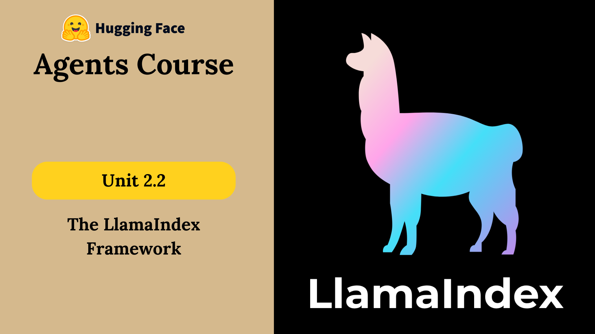

# Introduction to LlamaIndex & LlmaHub 🚀

Build LLM-powered agents using the [**LlamaIndex**](https://www.llamaindex.ai/) toolkit.



## 🌟 What is LlamaIndex?

**LlamaIndex** is a complete toolkit for creating agents powered by Large Language Models (LLMs) over your data using **indexes** and **workflows**.

We’ll focus on three main parts:

- **Components**
- **Agents and Tools**
- **Workflows**

---

## 🧱 Key Concepts

### ✅ Components
Basic building blocks like **prompts**, **models**, and **databases**. They connect LlamaIndex with other tools and libraries.

### 🛠 Tools
Specialized components for tasks like **search**, **calculation**, or **API access**. They empower agents to perform actions.

### 🧠 Agents
Autonomous units that **use tools** and **make decisions** to accomplish complex goals.

### 🔁 Workflows
Step-by-step logic pipelines (a.k.a. *agentic workflows*) that structure tasks even without explicit agents.

---

## 💡 What Makes LlamaIndex Special?

- **Clear Workflow System**: Event-driven, async-first syntax for composable logic.
- **LlamaParse Integration**: High-quality document parser built for LlamaIndex (paid feature).
- **Rich Ecosystem**: Reliable, production-tested components for LLMs, retrievers, and more.
- **LlamaHub**: A registry of 100s of components, agents, and tools ready to plug into your project.

---

# LlamaHub 🚀

**LlamaHub** is a registry of hundreds of integrations, agents and tools that you can use within LlamaIndex.

## 🛠️ Installation 
LlamaIndex installation instructions are available as a well-structured overview on [LlamaHub](https://llamahub.ai/).

Installation commands generally follow an easy-to-remember format

```python
pip install llama-index-{component-type}-{framework-name}
```
**Example**
```python
pip install llama-index-llms-huggingface-api llama-index-embeddings-huggingface
```

## ⚙️ Usage
Hugging Face inference API for an LLM Compnent.
```python
from llama_index.llms.huggingface_api import HuggingFaceInferenceAPI
import os
from dotenv import load_dotenv

# Load the .env file
load_dotenv()

# Retrieve HF_TOKEN from the environment variables
hf_token = os.getenv("HF_TOKEN")

llm = HuggingFaceInferenceAPI(
    model_name="Qwen/Qwen2.5-Coder-32B-Instruct",
    temperature=0.7,
    max_tokens=100,
    token=hf_token,
)

response = llm.complete("Hello, how are you?")
print(response)
# I am good, how can I help you today?
```

## 🔗 Resources

- [LlamaIndex Guide](https://docs.llamaindex.ai/en/stable/getting_started/starter_example/)
- [LlamaIndex Agents](https://docs.llamaindex.ai/en/stable/use_cases/agents/)
- [LlamaIndex Examples](https://docs.llamaindex.ai/en/stable/examples/)
- [LlamaHub](https://llamahub.ai/)
- [LlamaIndex Components Guide](https://docs.llamaindex.ai/en/stable/module_guides/)
- [LlamaIndex Learn](https://docs.llamaindex.ai/en/stable/understanding/)
