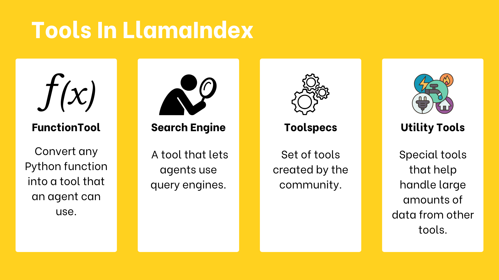

# 🧰 Using Tools in LlamaIndex
<a href="./tools.ipynb" target="_blank">
  
</a>

Defining a clear set of Tools is crucial to performance.

---

## 🔑 Tool Types in LlamaIndex

There are **four main types** of tools:



1. `FunctionTool`: Convert any Python function into a tool that an agent can use. It automatically figures out how the function works.
2. `QueryEngineTool`: A tool that lets agents use query engines. Since agents are built on query engines, they can also use other agents as tools.
3. `Toolspecs`: Sets of tools created by the community, which often include tools for specific services like Gmail.
4. `Utility Tools`: Special tools that help handle large amounts of data from other tools.


### 1. `FunctionTool`
- Wraps any Python function to make it available to agents.
- Automatically infers function input/output.
- Requires `name` and `description` to guide the LLM.
- Can pas synchronous or asynchronous function to the tool.

**Example:**
```python
from llama_index.core.tools import FunctionTool

def get_weather(location: str) -> str:
    """Useful for getting the weather for a given location."""
    print(f"Getting weather for {location}")
    return f"The weather in {location} is sunny"

tool = FunctionTool.from_defaults(
    get_weather,
    name="my_weather_tool",
    description="Useful for getting the weather for a given location.",
)
tool.call("New York")
```

---

### 2. `QueryEngineTool`
- The `QueryEngine` we defined in the previous unit can be easily transformed into a tool using the `QueryEngineTool` class

**Example:**
```python
from llama_index.core import VectorStoreIndex
from llama_index.core.tools import QueryEngineTool
from llama_index.llms.huggingface_api import HuggingFaceInferenceAPI
from llama_index.embeddings.huggingface import HuggingFaceEmbedding
from llama_index.vector_stores.chroma import ChromaVectorStore

embed_model = HuggingFaceEmbedding("BAAI/bge-small-en-v1.5")

db = chromadb.PersistentClient(path="./alfred_chroma_db")
chroma_collection = db.get_or_create_collection("alfred")
vector_store = ChromaVectorStore(chroma_collection=chroma_collection)

index = VectorStoreIndex.from_vector_store(vector_store, embed_model=embed_model)

llm = HuggingFaceInferenceAPI(model_name="Qwen/Qwen2.5-Coder-32B-Instruct")
query_engine = index.as_query_engine(llm=llm)
tool = QueryEngineTool.from_defaults(query_engine, name="some useful name", description="some useful description")
```

---

### 3. `ToolSpec` (Tool Specifications)
- Collections of tools grouped for specific domains.
- Example: `GmailToolSpec` for Gmail integration.

**Example:**
```python
# Install the Google Toolspec
pip install llama-index-tools-google

#Load the toolspec & Covert to list of tools.
from llama_index.tools.google import GmailToolSpec

tool_spec = GmailToolSpec()
tool_spec_list = tool_spec.to_tool_list()
```
## 🧩 MCP ToolSpec Support
- LlamaIndex also allows using MCP tools through a [ToolSpec on the LlamaHub](https://llamahub.ai/l/tools/llama-index-tools-mcp?from=).
- Connects to an MCP server to run agents.

**Example:**
```python
from llama_index.tools.mcp import BasicMCPClient, McpToolSpec

# We consider there is a mcp server running on 127.0.0.1:8000, or you can use the mcp client to connect to your own mcp server.
mcp_client = BasicMCPClient("http://127.0.0.1:8000/sse")
mcp_tool = McpToolSpec(client=mcp_client)

# get the agent
agent = await get_agent(mcp_tool)

# create the agent context
agent_context = Context(agent)
```
---

### 4. Utility Tools
Oftentimes, directly querying an API **can return an excessive amount of data**, some of which may be irrelevant, overflow the context window of the LLM, or unnecessarily increase the number of tokens that you are using.

#### **2 Main Utility Tools*

#### a. `OnDemandToolLoader`
- This tool turns any existing LlamaIndex data loader (BaseReader class) into a tool that an agent can use.
- The tool can be called with all the parameters needed to trigger `load_data` from the data loader, along with a natural language query string.
- All 3 steps happen in a single tool call:
- - Load Data --> Index it(vector store) -->Query (on demand)

#### b. `LoadAndSearchToolSpec`
- Wraps any tool and returns two tools: one for loading, one for searching.
- Supports contextual indexing for large API responses.


---

## 🔗 Explore More
- Find additional ToolSpecs and utility tools on [**LlamaHub**](https://llamahub.ai).
- Next: Use tools to build customizable agent workflows.
