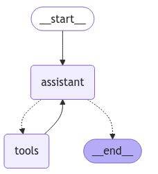
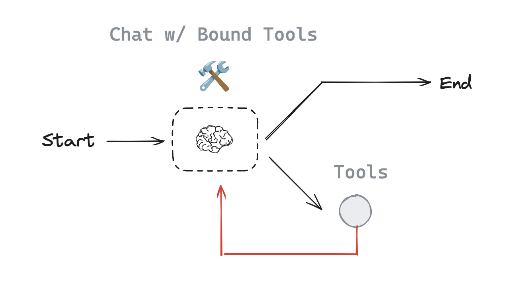

# 🧾 Document Analysis Graph

<a href="./agent.ipynb" target="_blank">
  
</a>

As Mr. Wayne’s ever-reliable butler, Alfred assists with organizing his notes, meals, and schedules—even in his absence. This project introduces a **LangGraph-powered document analysis system** that mimics Alfred's workflow.

---

## 🧠 Purpose

Build a **document analysis system** using LangGraph that can:

* 📸 Process image documents (e.g., training/meal notes)
* 🧠 Extract text using vision model (Vision Language Model)
* 🔢 Perform calculations
* ✍️ Analyze and summarize content
* 📋 Execute specific instructions (e.g., generate shopping lists)

### Workflow
The workflow we’ll build follows this structured schema:


---

## ⚙️ Setup Instructions

### 🧪 Install Dependencies

```bash
%pip install langgraph langchain_openai langchain_core
```

### 📦 Imports

```python
import base64
from typing import List, TypedDict, Annotated, Optional
from langchain_openai import ChatOpenAI
from langchain_core.messages import AnyMessage, SystemMessage, HumanMessage
from langgraph.graph.message import add_messages
from langgraph.graph import START, StateGraph
from langgraph.prebuilt import ToolNode, tools_condition
from IPython.display import Image, display
```

---

## 🧾 Agent State Definition
`AnyMessage` is a class from Langchain that defines messages, and `add_messages` is an operator that adds the latest message rather than overwriting it with the latest state.

```python
class AgentState(TypedDict):
    # The document provided
    input_file: Optional[str]  # Contains file path (PDF/PNG)
    messages: Annotated[list[AnyMessage], add_messages]
```

---

## 🧰 Tools

### 🖼️ Image Text Extractor

Extracts text from a base64-encoded image:

```python
def extract_text(img_path: str) -> str:
    """
    Extract text from an image file using a multimodal model.
    
    Master Wayne often leaves notes with his training regimen or meal plans.
    This allows me to properly analyze the contents.
    """
    all_text = ""
    try:
        # Read image and encode as base64
        with open(img_path, "rb") as image_file:
            image_bytes = image_file.read()

        image_base64 = base64.b64encode(image_bytes).decode("utf-8")

        # Prepare the prompt including the base64 image data
        message = [
            HumanMessage(
                content=[
                    {
                        "type": "text",
                        "text": (
                            "Extract all the text from this image. "
                            "Return only the extracted text, no explanations."
                        ),
                    },
                    {
                        "type": "image_url",
                        "image_url": {
                            "url": f"data:image/png;base64,{image_base64}"
                        },
                    },
                ]
            )
        ]

        # Call the vision-capable model
        response = vision_llm.invoke(message)

        # Append extracted text
        all_text += response.content + "\n\n"

        return all_text.strip()
    except Exception as e:
        # A butler should handle errors gracefully
        error_msg = f"Error extracting text: {str(e)}"
        print(error_msg)
        return ""
```

### ➗ Divider

Simple division tool:

```python
def divide(a: int, b: int) -> float:
    return a / b
```

Bind tools to model:

```python
tools = [
    divide,
    extract_text
]

llm = ChatOpenAI(model="gpt-4o")
llm_with_tools = llm.bind_tools(tools, parallel_tool_calls=False)
```
**The node**
```python
def assistant(state: AgentState):
    # System message
    textual_description_of_tool="""
extract_text(img_path: str) -> str:
    Extract text from an image file using a multimodal model.

    Args:
        img_path: A local image file path (strings).

    Returns:
        A single string containing the concatenated text extracted from each image.
divide(a: int, b: int) -> float:
    Divide a and b
"""
    image=state["input_file"]
    sys_msg = SystemMessage(content=f"You are a helpful butler named Alfred that serves Mr. Wayne and Batman. You can analyse documents and run computations with provided tools:\n{textual_description_of_tool} \n You have access to some optional images. Currently the loaded image is: {image}")

    return {
        "messages": [llm_with_tools.invoke([sys_msg] + state["messages"])],
        "input_file": state["input_file"]
    }
```

---

## 🔁 ReAct Workflow Graph
The agent follows what’s known as the ReAct pattern (Reason-Act-Observe)

1. **Reason** about his documents and requests
2. **Act** by using appropriate tools
3. **Observe** the results
4. **Repeat** as necessary until I’ve fully addressed his needs

### Nodes:

* `"assistant"`: Reason, decide on actions
* `"tools"`: Execute tool calls

### Flow:

```python
# The graph
builder = StateGraph(AgentState)

# Define nodes: these do the work
builder.add_node("assistant", assistant)
builder.add_node("tools", ToolNode(tools))

# Define edges: these determine how the control flow moves
builder.add_edge(START, "assistant")
builder.add_conditional_edges(
    "assistant",
    # If the latest message requires a tool, route to tools
    # Otherwise, provide a direct response
    tools_condition,
)
builder.add_edge("tools", "assistant")
react_graph = builder.compile()

# Show the butler's thought process
display(Image(react_graph.get_graph(xray=True).draw_mermaid_png()))
```

🔄 **Loop**: assistant → tools → assistant → … until no tool is needed → END


---

## 🔍 Examples

### Example 1: Calculation

```python
messages = [HumanMessage(content="Divide 6790 by 5")]
messages = react_graph.invoke({"messages": messages, "input_file": None})

# Show the messages
for m in messages['messages']:
    m.pretty_print()
```
**Conversation**
```bash
Human: Divide 6790 by 5

AI Tool Call: divide(a=6790, b=5)

Tool Response: 1358.0

Alfred: The result of dividing 6790 by 5 is 1358.0.
```

🧠 Result: `The result of dividing 6790 by 5 is 1358.0.`

---

### Example 2: Image Document Analysis

```python
messages = [HumanMessage(content="According to the note provided by Mr. Wayne in the provided images. What's the list of items I should buy for the dinner menu?")]
messages = react_graph.invoke({"messages": messages, "input_file": "Batman_training_and_meals.png"})
```
**Interaction**
```bash
Human: According to the note provided by Mr. Wayne in the provided images. What's the list of items I should buy for the dinner menu?

AI Tool Call: extract_text(img_path="Batman_training_and_meals.png")

Tool Response: [Extracted text with training schedule and menu details]

Alfred: For the dinner menu, you should buy the following items:

1. Grass-fed local sirloin steak
2. Organic spinach
3. Piquillo peppers
4. Potatoes (for oven-baked golden herb potato)
5. Fish oil (2 grams)

Ensure the steak is grass-fed and the spinach and peppers are organic for the best quality meal.
```

🧠 Result:

```
1. Grass-fed local sirloin steak
2. Organic spinach
3. Piquillo peppers
4. Potatoes
5. Fish oil (2 grams)
```

---

## 🧵 Key Takeaways

* Define **clear tools** for tasks
* Use **state tracking** with `add_messages`
* Implement **robust control flow** using LangGraph
* Design around the **ReAct pattern**: Reason → Act → Observe → Repeat


