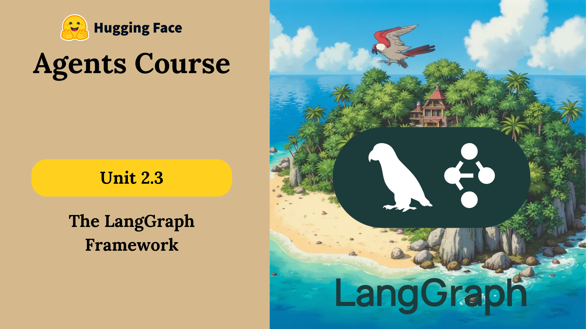

# 🚀 Introduction to LangGraph – Unit 2.3

Welcome to the next step in your journey toward building structured and production-ready LLM applications using **LangGraph**.

`LangGraph` is a framework that empowers you to **orchestrate complex agent workflows** with clear control over their flow, making it ideal for robust AI applications.

---

## 🧭 Module Overview

In this unit, you’ll explore:

1️⃣ **What is LangGraph, and when to use it?**
2️⃣ **Building Blocks of LangGraph**
3️⃣ **Alfred, the Mail Sorting Butler** ✉️
4️⃣ **Alfred, the Document Analyst Agent** 📄
5️⃣ **Quiz** ✅

---

## 🛠️ Why LangGraph?

LangGraph helps you:

* Structure and control multi-step LLM workflows
* Build stateful and loop-capable agents
* Design production-grade, reliable AI systems

> ✅ Best used with powerful models like **GPT-4o**, which is highly compatible with LangGraph.

---

## 📚 Additional Resources

* 🔗 [LangGraph Agents – Examples](https://langchain-ai.github.io/langgraph/)
* 🎓 [LangChain Academy – Full LangGraph Course](https://academy.langchain.com/courses/intro-to-langgraph)

---

By the end of this unit, you’ll be equipped to build **organized, agentic, and production-ready applications** using LangGraph.

