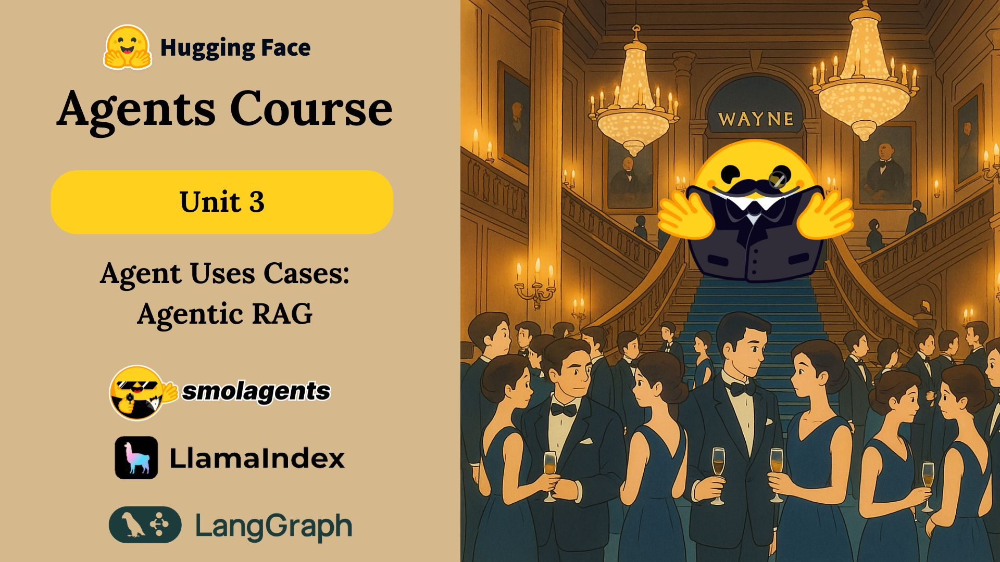

# 🧠 Unit 3: Use Cases for Agent RAG

This unit focuses on **Agentic RAG system** Retrieval-Augmented Generation (RAG) - a powerful technique that combines the capabilities of LLMs with custom knowledge bases to create more informed and contextually aware AI agents.

## 📚 Course Progress

### ✅ Completed Units
- [x] Unit 3: [Agentic RAG](./Agentic-RAG.md) – Advanced RAG implementations
- [x] Unit 3: [Creating RAG Tool](./Creating-RAG-Tool.md) – Building custom knowledge retrieval systems
- [x] Unit 3: [Building and Integrating Tools](./Building-and-Integrating-Tools-for-Agent.md) – Extending agent capabilities
- [x] Unit 3: [Creating Gala Agent](./Creating-Gala-Agent.md) – Implementing an AI host with RAG capabilities

## 📌 Units Breakdown

### Unit 3.1: **Agentic RAG**
- Advanced RAG techniques
- Multi-index knowledge access
- Real-time information integration
- Conversation memory and context
- [Start Learning →](./Agentic-RAG.md)

### Unit 3.2: **Creating RAG Tool**
- Introduction to RAG
- Dataset preparation and management
- Building retrieval systems
- Implementing BM25Retriever
- Creating custom tools
- [Start Learning →](./Creating-RAG-Tool.md)

### Unit 3.3: **Building and Integrating Tools**
- Tool development best practices
- Integration patterns
- Error handling and fallbacks
- Performance optimization
- [Start Learning →](./Building-and-Integrating-Tools-for-Agent.md)

### Unit 3.4: **Creating Gala Agent**
- Building Alfred - The AI host
- Integrating RAG with agent workflows
- Real-time information retrieval
- Guest interaction handling
- [Start Learning →](./Creating-Gala-Agent.md)

## 🤖 When to Use RAG

📋 Click to expand

Use RAG when:

- You need **domain-specific knowledge** in your agent
- You want to **reduce hallucinations** in LLM responses
- You have **custom datasets** that need to be accessed
- You require **real-time information retrieval**
- You want to **maintain up-to-date information**
- You have **Memory of past interaction**.

Skip it when:
- Your use case only requires general knowledge
- You don't have a structured knowledge base
- Real-time information isn't critical

## 🔧 Key Components of RAG Systems

🔍 Click to expand

To build effective RAG systems, you need:

- **Knowledge Base** – Your custom dataset or documents
- **Retriever** – Algorithm to find relevant information
- **LLM Integration** – Combining retrieved data with LLM capabilities
- **Tool System** – Interface between agent and knowledge base
- **Query Processing** – Understanding and optimizing user queries
- **Response Generation** – Creating coherent, informed responses

## 🎯 Learning Objectives

- [x] Understand RAG fundamentals and use cases
- [x] Build custom retrieval systems
- [x] Create agents with domain-specific knowledge
- [x] Implement real-time information retrieval
- [x] Develop advanced RAG capabilities
- [x] Optimize RAG performance and accuracy

## 📚 Additional Resources

- [Hugging Face Datasets](https://huggingface.co/datasets)
- [LlamaIndex Documentation](https://docs.llamaindex.ai/)
- [RAG Best Practices](https://www.pinecone.io/learn/retrieval-augmented-generation/)
- [Hugging Face Spaces](https://huggingface.co/spaces)
