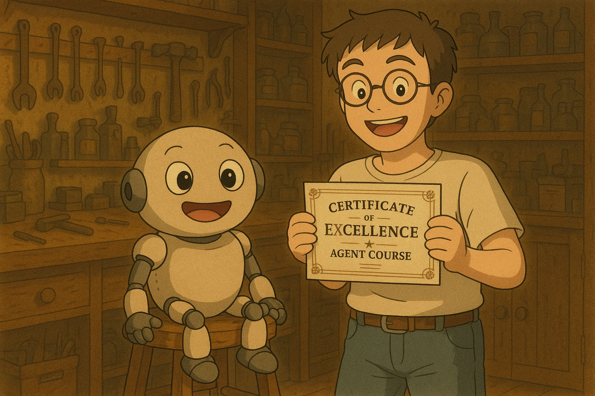

# 🧠 Course Complete & Benchmark Mastered! ✅

I’m excited to share that I’ve **successfully completed the AI Agents course** and achieved an outstanding **+90% score** on the **GAIA benchmark**! 🚀💡
This milestone reflects hands-on skills in building intelligent, tool-using agents ready for real-world challenges.

---

## 🎓 Claim Your Certificate

If you scored **above 30%**, congratulations — you're eligible to claim your **official certificate** of completion! 🏅

👉 I proudly earned mine with a top-tier score!

.webp)

📄 [**View Certificate PDF**](../certificate.pdf)

---
### ✅ How to Claim:

1. Go to the [certificate page](https://huggingface.co/spaces/agents-course/Unit4-Final-Certificate).
2. Sign in with your Hugging Face account.
3. Enter your **full name** (this will appear on the certificate).
4. Click **"Get My Certificate"** to verify your score and download it.

---

## 🔍 What to Learn Next?

Agentic AI is evolving rapidly. To stay current and deepen your expertise, start exploring these two foundational protocols:

### 🔌 Model Context Protocol (MCP)

* Developed by **Anthropic**
* An open standard to connect AI models with tools, data, and environments
* Like a “USB-C for AI” — enables seamless tool integration
* Gaining adoption from **OpenAI, Google**, and others

📖 Learn more:

* [Anthropic’s MCP announcement](https://www.anthropic.com/news/model-context-protocol)
* [Anthropic MCP Doc](https://docs.anthropic.com/en/docs/agents-and-tools/mcp)
* [Blog on MCP](https://huggingface.co/blog/Kseniase/mcp)
* [Building an MCP Server](https://www.dailydoseofds.com/p/hands-on-building-an-mcp-server/)
* [MCP Docs](https://modelcontextprotocol.io/introduction)
* [Awesome MCP Server](https://mcp.so/)
* [MCP Servers](https://github.com/modelcontextprotocol/servers)

---

### 🤝 Agent-to-Agent Protocol (A2A)

* Developed by **Google**
* Facilitates communication and collaboration **between agents**
* Complements MCP by enabling **multi-agent cooperation**

📖 Learn more:

* [Google’s A2A announcement](https://developers.googleblog.com/en/a2a-a-new-era-of-agent-interoperability/)

---

🎯 Mastering these protocols will put you on the cutting edge of building powerful, connected AI agents.
