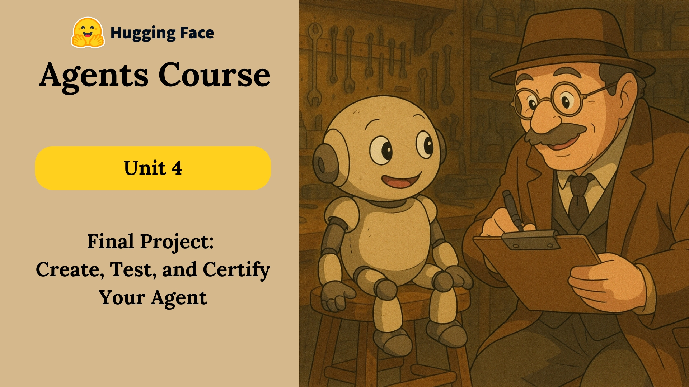

# 🎓 Unit 4: Final Project - Building Your AI Agent

Welcome to the final unit of the AI Agents course! This is where you'll put everything you've learned into practice by building your own sophisticated AI agent.



## 📚 Course Progress

### ✅ Completed Units
- [x] Unit 4.1: [What is GAIA?](./What%20is%20GAIA?.md) – Understanding the benchmark
- [x] Unit 4.2: [Final Hands-On](./Final-Hands-On.md) – Building your agent
- [x] Unit 4.3: [Conclusion](./Conclustion.md) – Course wrap-up

## 🎯 Project Overview

🔗 **Check out the full project here:**
👉 [**AI Agent – RobotPai**](https://huggingface.co/spaces/kishan-patel-dev/RobotPai/tree/main)

Your final challenge is to build an AI agent that can:
- Process and understand complex queries
- Use multiple tools effectively
- Maintain context and memory
- Provide accurate and helpful responses

### 🏆 Success Criteria
- Score **90% or higher** on the GAIA benchmark
- Implement all required features
- Follow best practices
- Provide clear documentation
- Make your code reproducible

## 📊 Evaluation with GAIA

The GAIA benchmark will test your agent's capabilities:
- 20 Level 1 questions from GAIA's validation set
- Questions requiring minimal tools and fewer reasoning steps
- Real-world problem-solving scenarios
- Exact match scoring system

## 🚀 Getting Started

1. **Setup Your Environment:**
   - Create a new Hugging Face Space
   - Set up your development environment
   - Install required dependencies

2. **Build Your Agent:**
   - Implement core functionality
   - Add custom tools
   - Test with sample questions
   - Optimize performance

3. **Submit for Evaluation:**
   - Make your space public
   - Document your implementation
   - Submit through the API
   - Check your score on the leaderboard

## 🏗️ Project Structure

```
your-agent/
├── app.py              # Main application file
├── agent.py            # Agent implementation
├── system_prompt/        # System Prompt 
├── requirements.txt    # Dependencies
└── README.md          # Documentation
```

## 📚 Resources

- [GAIA Benchmark Documentation](https://huggingface.co/spaces/gaia-benchmark/leaderboard)
- [Hugging Face Spaces Guide](https://huggingface.co/docs/hub/spaces)
- [API Documentation](https://agents-course-unit4-scoring.hf.space/docs)
- [Student Leaderboard](https://huggingface.co/spaces/learn-gaia/leaderboard)

## 🎨 Example Implementation

Check out a successful implementation:
[RobotPai - AI Agent](https://huggingface.co/spaces/kishan-patel-dev/RobotPai/tree/main)

## ⚠️ Important Notes

- Your Hugging Face Space must be public
- Code must be properly documented
- Agent must be reproducible
- Scoring is based on exact matches
- Submissions without proper code backing will be removed

## 🎓 Next Steps

1. Read through the [What is GAIA?](./What%20is%20GAIA?.md) guide
2. Follow the [Final Hands-On](./Final-Hands-On.md) instructions
3. Build and test your agent
4. Submit for evaluation
5. Check the [Conclusion](./Conclustion.md) for next steps

## 🎓 Claim Your Certificate

If you scored **above 30%**, congratulations — you're eligible to claim your **official certificate** of completion! 🏅

👉 I proudly earned mine with a top-tier score!

.webp)

📄 [**View Certificate PDF**](../certificate.pdf)

Good luck with your final project! Remember, this is your chance to showcase everything you've learned about building AI agents. 🚀
