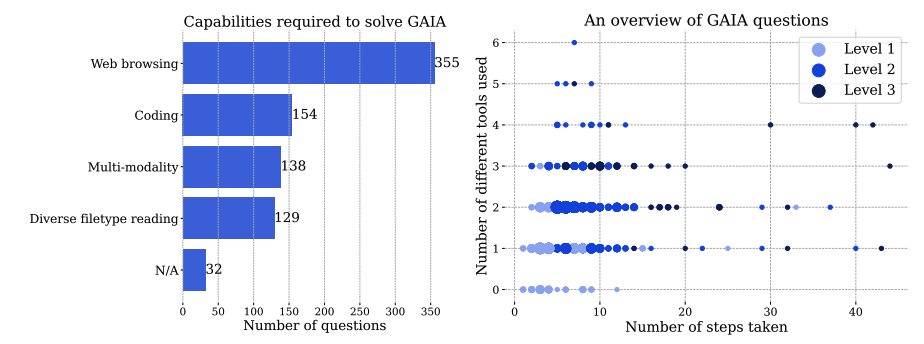

# 🧠 What is GAIA?

**GAIA** (General AI Assistant) is a **benchmark** designed to test AI agents on **real-world tasks** requiring:

* 🔎 Multi-step reasoning
* 🖼️ Multimodal understanding
* 🌐 Web browsing
* 🛠️ Effective tool use

Introduced in the paper [*“GAIA: A Benchmark for General AI Assistants,”*](https://huggingface.co/papers/2311.12983) it sets a high bar for measuring progress toward **truly general-purpose AI assistants**.

---

## 📊 Human vs. AI Performance

| Participant               | Accuracy                    |
| ------------------------- | --------------------------- |
| 🧑 Humans                 | \~92%                       |
| 🤖 GPT-4 (with plugins)   | \~15%                       |
| 🧪 Deep Research (OpenAI) | **67.36%** (validation set) |

> GAIA tasks are **easy for humans**, but **highly challenging for current AI systems**.

---

## 🌱 Core Principles of GAIA

GAIA is built on four key pillars:

* **🔍 Real-world difficulty**: Tasks require multi-step reasoning, multimodal understanding, and tool interaction.
* **🧾 Human interpretability**: Clear and understandable questions.
* **🛡️ Non-gameability**: No shortcuts—answers require full task completion.
* **🧰 Simple evaluation**: Concise, factual responses for easy benchmarking.

---

## 🧩 Difficulty Levels

GAIA tasks are categorized by complexity:

| Level | Description                                 |
| ----- | ------------------------------------------- |
| 1️⃣   | <5 steps, minimal tools                     |
| 2️⃣   | 5–10 steps, multiple tools                  |
| 3️⃣   | Long-term planning and advanced integration |

---

## 🧠 Example of a Hard GAIA Question

> *“Which of the fruits shown in the 2008 painting ‘Embroidery from Uzbekistan’ were served as part of the October 1949 breakfast menu for the ocean liner later used as a prop in the film ‘The Last Voyage’? Give the items as a comma-separated list, ordered clockwise from 12 o’clock. Use plural forms.”*

### Challenges:

* 🖼️ Multimodal reasoning (visual recognition)
* 🕵️ Multi-hop retrieval (painting → film → ship → menu)
* 🧠 Sequencing and structured output

This kind of task highlights where standalone LLMs often fall short, making GAIA an ideal benchmark for **agent-based systems** that can reason, retrieve, and execute over multiple steps and modalities.

---

## 📈 GAIA in Action

* **Live Evaluation**: Submit your agent on the public **GAIA Leaderboard** via [Hugging Face](https://huggingface.co/gaia-benchmark)
* **Test Set**: 300 real-world tasks designed to push the limits of current AI

---

## 📚 Want to Learn More?

* [📄 GAIA Paper](https://huggingface.co/papers/2311.12983)
* [📢 OpenAI Deep Research Release](https://openai.com/index/introducing-deep-research/)
* [🛠️ Open-source DeepResearch Tools](https://huggingface.co/blog/open-deep-research)
